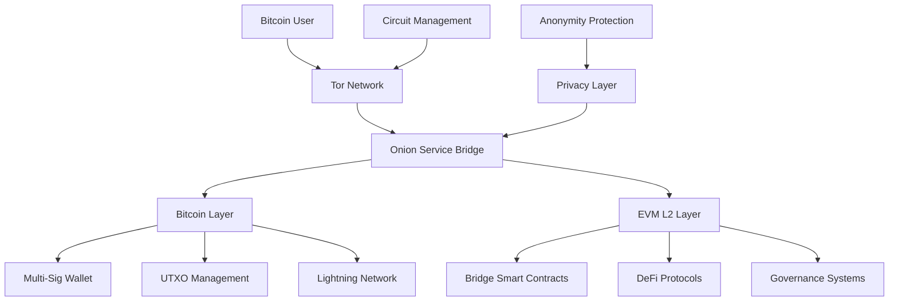
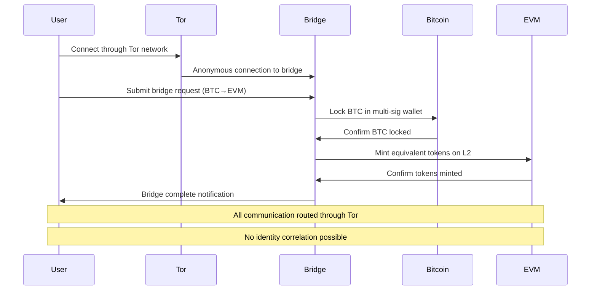

# BTC-to-EVM Privacy Bridge with Tor

> **📢 ATTRIBUTION: This project idea originated from the Tor Project's cryptocurrency privacy initiative**
> 
> **Focus: Prototyping a system where BTC is bridged to EVM L2 with all network activity routed via Tor/Onion services**

---

## Overview

A project to prototype a Bitcoin-to-Ethereum Virtual Machine (EVM) bridge system where all network activity routes through Tor and Onion services to preserve user anonymity. This system addresses the critical need for Bitcoin users to participate in EVM-based funding mechanisms, governance systems, and DeFi protocols while maintaining complete privacy and avoiding the trust and UX hurdles of traditional bridges.

## Problem Statement

Tor users heavily rely on Bitcoin for privacy and censorship resistance, but many funding mechanisms, public goods initiatives, and governance systems operate on EVM chains. Traditional BTC-to-EVM bridges introduce significant UX challenges, trust requirements, and privacy concerns. Users must trust bridge operators, reveal their identities, and risk deanonymization through network traffic analysis. This project aims to solve these issues by creating a privacy-first bridge that routes all activity through Tor's anonymity network.

## Proposed Solution

### Core Components

1. **Privacy-First Bridge Architecture**
   - **Tor-Routed Bridge**: All bridge operations go through Tor network
   - **Onion Service Endpoints**: Bridge services accessible via .onion addresses
   - **Anonymous User Registration**: No KYC or identity requirements
   - **Circuit Rotation**: Automatic Tor circuit management for privacy

2. **Bitcoin Integration Layer**
   - **UTXO Management**: Secure Bitcoin wallet and transaction handling
   - **Multi-Signature Security**: Distributed key management for bridge security
   - **Lightning Network Support**: Fast, low-cost Bitcoin transfers
   - **Privacy-Enhanced Transactions**: CoinJoin and other privacy techniques

3. **EVM Integration Layer**
   - **L2 Bridge Contracts**: Smart contracts for cross-chain asset management
   - **Privacy-Preserving DeFi**: Anonymous yield farming and liquidity provision
   - **Governance Participation**: Anonymous voting and proposal submission
   - **Quadratic Funding**: Privacy-preserving public goods funding

## Technical Architecture

### System Architecture


### Bridge Smart Contract Example
```solidity
// Example bridge contract for privacy-preserving BTC to EVM transfers
// SPDX-License-Identifier: MIT
pragma solidity ^0.8.19;

import "@openzeppelin/contracts/security/ReentrancyGuard.sol";
import "@openzeppelin/contracts/security/Pausable.sol";
import "@openzeppelin/contracts/access/Ownable.sol";

contract PrivacyBridge {
    struct BridgeRequest {
        bytes32 requestId;
        address recipient;
        uint256 amount;
        uint256 timestamp;
        bool executed;
        bool cancelled;
    }
    
    mapping(bytes32 => BridgeRequest) public bridgeRequests;
    mapping(address => uint256) public userBalances;
    
    event BridgeRequestCreated(
        bytes32 indexed requestId,
        address indexed recipient,
        uint256 amount,
        uint256 timestamp
    );
    
    event BridgeRequestExecuted(
        bytes32 indexed requestId,
        address indexed recipient,
        uint256 amount
    );
    
    event BridgeRequestCancelled(bytes32 indexed requestId);
    
    modifier onlyValidRequest(bytes32 requestId) {
        require(bridgeRequests[requestId].recipient != address(0), "Invalid request");
        require(!bridgeRequests[requestId].executed, "Request already executed");
        require(!bridgeRequests[requestId].cancelled, "Request already cancelled");
        _;
    }
    
    function createBridgeRequest(
        address recipient,
        uint256 amount
    ) external payable returns (bytes32) {
        require(msg.value == amount, "Incorrect amount sent");
        require(recipient != address(0), "Invalid recipient");
        
        bytes32 requestId = keccak256(
            abi.encodePacked(
                recipient,
                amount,
                block.timestamp,
                msg.sender
            )
        );
        
        bridgeRequests[requestId] = BridgeRequest({
            requestId: requestId,
            recipient: recipient,
            amount: amount,
            timestamp: block.timestamp,
            executed: false,
            cancelled: false
        });
        
        emit BridgeRequestCreated(requestId, recipient, amount, block.timestamp);
        
        return requestId;
    }
    
    function executeBridgeRequest(bytes32 requestId) 
        external 
        onlyValidRequest(requestId) 
        onlyOwner 
    {
        BridgeRequest storage request = bridgeRequests[requestId];
        request.executed = true;
        
        // Transfer funds to recipient
        (bool success, ) = request.recipient.call{value: request.amount}("");
        require(success, "Transfer failed");
        
        emit BridgeRequestExecuted(
            requestId, 
            request.recipient, 
            request.amount
        );
    }
    
    function cancelBridgeRequest(bytes32 requestId) 
        external 
        onlyValidRequest(requestId) 
        onlyOwner 
    {
        BridgeRequests storage request = bridgeRequests[requestId];
        request.cancelled = true;
        
        // Return funds to original sender
        (bool success, ) = request.recipient.call{value: request.amount}("");
        require(success, "Refund failed");
        
        emit BridgeRequestCancelled(requestId);
    }
    
    function getUserBalance(address user) external view returns (uint256) {
        return userBalances[user];
    }
}
```

### Tor Integration Example
```typescript
// Example Tor integration for privacy bridge
import { TorClient, OnionService } from '@tor/privacy-sdk';
import { BitcoinBridge } from './bitcoin-bridge';
import { EVMBridge } from './evm-bridge';

class PrivacyBridge {
    private torClient: TorClient;
    private onionService: OnionService;
    private bitcoinBridge: BitcoinBridge;
    private evmBridge: EVMBridge;
    
    constructor() {
        this.torClient = new TorClient({
            anonymityLevel: 'maximum',
            circuitTimeout: 60000,
            maxRetries: 5
        });
        
        this.onionService = new OnionService({
            name: 'privacy-bridge',
            port: 8080,
            version: '3'
        });
        
        this.bitcoinBridge = new BitcoinBridge();
        this.evmBridge = new EVMBridge();
    }
    
    async start(): Promise<void> {
        // Start onion service for privacy
        await this.onionService.start();
        
        console.log(`Privacy Bridge available at: ${this.onionService.onionAddress}`);
        
        // Set up bridge endpoints
        this.setupEndpoints();
    }
    
    private setupEndpoints(): void {
        // BTC to EVM bridge endpoint
        this.onionService.post('/api/bridge/btc-to-evm', async (req, res) => {
            try {
                const { amount, recipient, evmAddress } = req.body;
                
                // Create anonymous bridge request
                const requestId = await this.createBridgeRequest({
                    amount,
                    recipient,
                    evmAddress,
                    timestamp: Date.now()
                });
                
                // Route through Tor for maximum privacy
                const anonymousRequest = await this.torClient.anonymizeData({
                    requestId,
                    amount,
                    recipient: this.torClient.anonymizeId(recipient),
                    evmAddress: this.torClient.anonymizeId(evmAddress)
                });
                
                // Submit to bridge through anonymous channel
                const result = await this.submitBridgeRequest(anonymousRequest);
                
                res.json({
                    success: true,
                    requestId,
                    status: 'pending',
                    estimatedTime: '10-30 minutes'
                });
                
            } catch (error) {
                res.status(500).json({
                    success: false,
                    error: error.message
                });
            }
        });
        
        // Bridge status endpoint
        this.onionService.get('/api/bridge/status/:requestId', async (req, res) => {
            try {
                const { requestId } = req.params;
                
                // Check bridge status through anonymous channel
                const status = await this.getBridgeStatus(requestId);
                
                res.json({
                    success: true,
                    status
                });
                
            } catch (error) {
                res.status(500).json({
                    success: false,
                    error: error.message
                });
            }
        });
    }
    
    private async createBridgeRequest(request: BridgeRequest): Promise<string> {
        // Generate unique request ID
        const requestId = this.generateRequestId(request);
        
        // Store request anonymously
        await this.storeBridgeRequest(requestId, request);
        
        return requestId;
    }
    
    private async submitBridgeRequest(request: AnonymousBridgeRequest): Promise<any> {
        // Submit to Bitcoin bridge through Tor
        const bitcoinResult = await this.bitcoinBridge.submitRequest(request);
        
        // Submit to EVM bridge through Tor
        const evmResult = await this.evmBridge.submitRequest(request);
        
        return {
            bitcoin: bitcoinResult,
            evm: evmResult
        };
    }
    
    private async getBridgeStatus(requestId: string): Promise<BridgeStatus> {
        // Check Bitcoin bridge status
        const bitcoinStatus = await this.bitcoinBridge.getStatus(requestId);
        
        // Check EVM bridge status
        const evmStatus = await this.evmBridge.getStatus(requestId);
        
        return {
            requestId,
            bitcoin: bitcoinStatus,
            evm: evmStatus,
            overall: this.calculateOverallStatus(bitcoinStatus, evmStatus)
        };
    }
}

// Usage
const privacyBridge = new PrivacyBridge();
privacyBridge.start().catch(console.error);
```

### User Experience Flow


## Implementation Roadmap

### Phase 1: Core Architecture (3 months)
- Design privacy-first bridge architecture
- Implement Tor integration and onion services
- Create basic Bitcoin wallet integration
- Develop EVM smart contract framework
- Security analysis and threat modeling

### Phase 2: Bridge Development (4 months)
- Build Bitcoin multi-signature wallet system
- Implement EVM bridge smart contracts
- Create privacy-preserving DeFi protocols
- Develop governance integration
- Add Lightning Network support

### Phase 3: Privacy Features (3 months)
- Implement advanced Tor routing
- Add circuit rotation and management
- Create traffic obfuscation techniques
- Develop anonymity metrics
- Add privacy auditing tools

### Phase 4: Testing and Deployment (2 months)
- Security audit and penetration testing
- Performance testing under load
- User experience testing
- Documentation and guides
- Community deployment

## Business Model

### Open Source Contribution
- Complete bridge system is open source
- All smart contracts are publicly auditable
- Community-driven development and improvement
- Focus on privacy and accessibility

### Value Proposition
1. **For Bitcoin Users**: Privacy-preserving access to EVM ecosystem
2. **For DeFi Protocols**: Access to Bitcoin liquidity with privacy
3. **For Governance**: Bitcoin user participation in EVM governance
4. **For Privacy**: Complete anonymity in cross-chain operations

## Key Features

### Privacy Features
- **Network Anonymity**: All traffic routed through Tor
- **Identity Protection**: No KYC or identity requirements
- **Traffic Obfuscation**: Circuit rotation and mixing
- **Correlation Resistance**: Prevents deanonymization attacks
- **Anonymous Transactions**: No link between Bitcoin and EVM addresses

### Bridge Features
- **Multi-Signature Security**: Distributed key management
- **Lightning Network Support**: Fast, low-cost transfers
- **L2 Integration**: Support for multiple EVM L2s
- **DeFi Protocols**: Anonymous yield farming and liquidity
- **Governance Participation**: Anonymous voting and proposals

### User Experience Features
- **Simple Interface**: Easy-to-use bridge interface
- **Automatic Privacy**: No manual Tor configuration required
- **Real-time Status**: Live bridge status updates
- **Mobile Support**: Mobile-optimized interface
- **Multi-Currency**: Support for various EVM tokens

## Target Market

### Primary Users
- Privacy-conscious Bitcoin holders
- DeFi protocol users and developers
- Governance system participants
- Public goods funding contributors
- Privacy advocates and activists

### Use Cases
- Anonymous DeFi participation
- Privacy-preserving governance voting
- Cross-chain public goods funding
- Anonymous yield farming
- Privacy-focused trading and liquidity

## Success Metrics

- Bridge transaction volume
- User adoption and retention
- Privacy protection effectiveness
- Security audit results
- Community contributions
- Real-world usage success
- Anonymity preservation rate

## Competitive Advantages

1. **Privacy**: Complete anonymity in cross-chain operations
2. **Security**: Multi-signature and distributed key management
3. **Accessibility**: Simple interface with automatic privacy
4. **Integration**: Seamless EVM ecosystem access
5. **Innovation**: Cutting-edge privacy technology
6. **Community**: Open source and community-driven

## Partnership Opportunities

### Technology Partners
- Tor Project development team
- Bitcoin development teams
- EVM L2 development teams
- DeFi protocol developers
- Privacy technology organizations

### Community Partners
- Bitcoin privacy advocates
- DeFi communities
- Governance system developers
- Privacy rights organizations
- Open source foundations

## Challenges and Mitigation

### Technical Challenges
- **Bridge Security**: Secure cross-chain asset management
  - *Mitigation*: Multi-signature systems, security audits, gradual rollout
- **Privacy Preservation**: Maintaining anonymity across chains
  - *Mitigation*: Advanced Tor routing, circuit management, traffic analysis
- **Performance**: Tor routing adds latency to transactions
  - *Mitigation*: Optimized routing, background processing, user education

### Adoption Challenges
- **User Education**: Complex technology for non-technical users
  - *Mitigation*: Simple interfaces, clear documentation, community support
- **Regulatory Concerns**: Privacy tools may face regulatory scrutiny
  - *Mitigation*: Legal compliance, transparency, community advocacy
- **Trust Requirements**: Users must trust bridge security
  - *Mitigation*: Open source code, security audits, community review

## Future Vision

### Near-term Enhancements
- Additional EVM L2 support
- Advanced privacy features
- Mobile application support
- Integration with more DeFi protocols
- Enhanced governance features

### Long-term Goals
- Universal privacy-preserving bridges
- Integration with major platforms
- Advanced anonymity techniques
- Global adoption and deployment
- Standardization of privacy bridges

## Community and Governance

- Open source development model
- Community-driven feature development
- Regular security audits and updates
- Transparent development process
- Collaboration with Tor Project team

## References

- [Tor Project](https://www.torproject.org/)
- [Bitcoin Development](https://bitcoin.org/en/development)
- [Ethereum Virtual Machine](https://ethereum.org/en/developers/docs/evm/)
- [Layer 2 Scaling](https://ethereum.org/en/layer-2/)
- [Privacy-Preserving Bridges](https://en.wikipedia.org/wiki/Blockchain_bridge)
