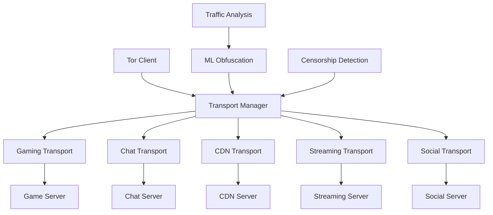

# Censorship Resistance via Pluggable Transports

> **📢 ATTRIBUTION: This project idea originated from the Tor Project's censorship circumvention team**
> 
> **Focus: Creating new pluggable transports and user-facing apps to bypass state-level firewalls**

---

## Overview

A project to develop new or improved pluggable transports and user-facing applications that disguise Tor traffic as innocuous, unblockable content such as video games, chat applications, or CDN traffic. This initiative addresses the critical need for censorship resistance by making Tor traffic indistinguishable from everyday internet usage, expanding access for users in repressive environments.

## Problem Statement

Tor's censorship-circumvention team has developed effective tools like Snowflake, bridges, and pluggable transports to bypass state-level firewalls. However, adoption of these technologies lags behind their potential due to the lack of easy entry points and user-friendly applications. Many users in censored regions struggle to access these tools, and existing transports may not be sufficient against increasingly sophisticated censorship techniques. This project aims to bridge this gap by creating more accessible and effective censorship resistance tools.

## Proposed Solution

### Core Components

1. **New Pluggable Transports**
   - **Gaming Transport**: Disguise Tor traffic as video game data
   - **Chat Transport**: Mimic popular messaging protocols
   - **CDN Transport**: Blend with content delivery network traffic
   - **Streaming Transport**: Resemble video streaming data
   - **Social Media Transport**: Appear as social platform traffic

2. **User-Facing Applications**
   - **Stealth Browser**: Browser that automatically uses transports
   - **Gaming Client**: Game launcher with built-in Tor access
   - **Chat Application**: Messaging app with censorship resistance
   - **Media Player**: Streaming app with privacy features
   - **Social Client**: Social media app with Tor integration

3. **Machine Learning Obfuscation**
   - **Traffic Pattern Learning**: ML models to mimic real traffic
   - **Behavioral Cloning**: Replicate user behavior patterns
   - **Adaptive Obfuscation**: Dynamic transport selection
   - **Censorship Detection**: Automatic transport switching

## Technical Architecture

### Transport Architecture


### Gaming Transport Implementation
```rust
// Example gaming transport that disguises Tor traffic
use tor_transport::{PluggableTransport, TransportConfig};
use game_protocol::{GameClient, GamePacket};

pub struct GamingTransport {
    game_client: GameClient,
    tor_stream: TorStream,
    obfuscation_level: ObfuscationLevel,
}

impl PluggableTransport for GamingTransport {
    async fn connect(&self, target: &str) -> Result<TransportStream, TransportError> {
        // Establish connection to game server
        let game_connection = self.game_client.connect().await?;
        
        // Create obfuscated Tor stream
        let tor_stream = self.create_tor_stream(target).await?;
        
        // Wrap Tor traffic in game packets
        let obfuscated_stream = self.obfuscate_traffic(tor_stream, game_connection).await?;
        
        Ok(obfuscated_stream)
    }
    
    async fn obfuscate_traffic(&self, tor_stream: TorStream, game_conn: GameConnection) -> Result<TransportStream, TransportError> {
        // Convert Tor data into game packet format
        let game_packets = self.convert_to_game_packets(tor_stream).await?;
        
        // Add realistic gaming behavior
        let realistic_packets = self.add_gaming_behavior(game_packets).await?;
        
        // Send through game connection
        self.send_game_packets(realistic_packets, game_conn).await?;
        
        Ok(TransportStream::new(game_conn))
    }
}

// Game packet structure for obfuscation
#[derive(Serialize, Deserialize)]
pub struct GamePacket {
    pub packet_type: GamePacketType,
    pub payload: Vec<u8>,
    pub timestamp: u64,
    pub sequence: u32,
    pub checksum: u32,
}

#[derive(Serialize, Deserialize)]
pub enum GamePacketType {
    PlayerMovement,
    ChatMessage,
    GameState,
    TorData, // Hidden Tor traffic
}
```

### ML-Driven Obfuscation
```python
# Machine learning model for traffic obfuscation
import torch
import torch.nn as nn
from transformers import AutoModel, AutoTokenizer

class TrafficObfuscationModel(nn.Module):
    def __init__(self, model_name: str):
        super().__init__()
        self.encoder = AutoModel.from_pretrained(model_name)
        self.tokenizer = AutoTokenizer.from_pretrained(model_name)
        self.obfuscation_head = nn.Linear(768, 512)
        self.traffic_generator = nn.Linear(512, 256)
        
    def forward(self, tor_traffic: torch.Tensor, target_protocol: str) -> torch.Tensor:
        # Encode Tor traffic
        encoded = self.encoder(tor_traffic)
        
        # Generate obfuscated traffic patterns
        obfuscated = self.obfuscation_head(encoded)
        
        # Generate protocol-specific traffic
        protocol_traffic = self.traffic_generator(obfuscated)
        
        return protocol_traffic
    
    def obfuscate_traffic(self, tor_data: bytes, target_protocol: str) -> bytes:
        # Convert Tor data to tensor
        tor_tensor = self.preprocess_tor_data(tor_data)
        
        # Generate obfuscated traffic
        with torch.no_grad():
            obfuscated = self.forward(tor_tensor, target_protocol)
        
        # Convert back to bytes
        return self.postprocess_traffic(obfuscated)

# Usage example
class MLTransportManager:
    def __init__(self):
        self.models = {
            'gaming': TrafficObfuscationModel('gaming-protocol-model'),
            'chat': TrafficObfuscationModel('chat-protocol-model'),
            'streaming': TrafficObfuscationModel('streaming-protocol-model')
        }
        
    async def select_best_transport(self, censorship_level: int) -> str:
        # Use ML to select the most effective transport
        if censorship_level > 8:
            return 'gaming'  # Gaming traffic is least suspicious
        elif censorship_level > 5:
            return 'streaming'  # Streaming is common and hard to block
        else:
            return 'chat'  # Chat protocols are usually allowed
```

## Implementation Roadmap

### Phase 1: Transport Development (4 months)
- Design new transport protocols
- Implement gaming transport prototype
- Create chat and CDN transports
- Develop transport switching logic
- Basic obfuscation techniques

### Phase 2: ML Integration (3 months)
- Collect traffic pattern data
- Train ML models for obfuscation
- Integrate ML with transport selection
- Implement behavioral cloning
- Adaptive transport switching

### Phase 3: Application Development (3 months)
- Build stealth browser application
- Create gaming client integration
- Develop chat application
- Implement media player
- Add social media client

### Phase 4: Testing and Deployment (2 months)
- Censorship resistance testing
- Performance optimization
- User experience refinement
- Documentation and guides
- Community deployment

## Business Model

### Open Source Contribution
- All transports and applications are open source
- Community-driven development and improvement
- Focus on accessibility and adoption
- No licensing fees or restrictions

### Value Proposition
1. **For Users**: Easy access to censorship resistance tools
2. **For Developers**: Simple integration with existing applications
3. **For Organizations**: Reliable access in censored regions
4. **For Research**: Advances in traffic obfuscation techniques

## Key Features

### Transport Features
- **Protocol Mimicry**: Exact replication of target protocols
- **Behavioral Cloning**: Realistic user behavior patterns
- **Adaptive Selection**: Automatic transport switching
- **Fallback Mechanisms**: Multiple transport options
- **Performance Optimization**: Minimal latency overhead

### Application Features
- **Seamless Integration**: Works with existing applications
- **Automatic Transport Selection**: No user configuration required
- **Censorship Detection**: Automatic response to blocking
- **User Experience**: Familiar interface and behavior
- **Cross-Platform Support**: Works on all major platforms

### Security Features
- **Traffic Analysis Resistance**: ML-driven obfuscation
- **Protocol Validation**: Ensures transport authenticity
- **Fallback Security**: Multiple layers of protection
- **Audit Trail**: Transparent operation for security review
- **Community Auditing**: Open source security review

## Target Market

### Primary Users
- Users in censored regions
- Journalists and activists
- Researchers and academics
- Business travelers
- Privacy-conscious individuals

### Geographic Focus
- Countries with internet censorship
- Regions with sophisticated blocking
- Areas with limited internet access
- Repressive regimes
- Academic institutions

## Success Metrics

- Censorship resistance effectiveness
- User adoption and retention
- Transport performance and reliability
- Community contributions
- Real-world deployment success
- Censorship detection accuracy
- User experience satisfaction

## Competitive Advantages

1. **Effectiveness**: ML-driven obfuscation techniques
2. **Accessibility**: User-friendly applications
3. **Adaptability**: Multiple transport options
4. **Performance**: Minimal latency overhead
5. **Community**: Open source development model
6. **Innovation**: Cutting-edge ML techniques

## Partnership Opportunities

### Technology Partners
- Tor Project development team
- Gaming companies and platforms
- Chat and messaging platforms
- CDN and streaming services
- Social media platforms

### Community Partners
- Human rights organizations
- Academic institutions
- Open source communities
- Privacy advocacy groups
- International organizations

## Challenges and Mitigation

### Technical Challenges
- **Protocol Complexity**: Modern protocols are complex to mimic
  - *Mitigation*: Focus on key protocol characteristics, use ML for pattern learning
- **Performance Overhead**: Obfuscation adds latency
  - *Mitigation*: Optimized algorithms, hardware acceleration, caching
- **Detection Evasion**: Censors may develop countermeasures
  - *Mitigation*: Continuous improvement, community feedback, adaptive techniques

### Adoption Challenges
- **User Education**: Complex technology for non-technical users
  - *Mitigation*: Simple interfaces, automatic operation, clear documentation
- **Platform Support**: Different platforms have different capabilities
  - *Mitigation*: Cross-platform development, platform-specific optimizations
- **Maintenance**: Keeping transports current with protocol changes
  - *Mitigation*: Automated updates, community maintenance, clear update processes

## Future Vision

### Near-term Enhancements
- Additional transport protocols
- Improved ML models
- Mobile application support
- Real-time censorship detection
- Advanced obfuscation techniques

### Long-term Goals
- Universal censorship resistance
- Integration with major platforms
- Advanced ML-driven obfuscation
- Global deployment and adoption
- Standardization of techniques

## Community and Governance

- Open source development model
- Community-driven feature development
- Regular security audits and updates
- Transparent development process
- Collaboration with Tor Project team

## References

- [Tor Project Pluggable Transports](https://2019.www.torproject.org/docs/pluggable-transports.html.en)
- [Snowflake Transport](https://snowflake.torproject.org/)
- [Machine Learning for Network Security](https://en.wikipedia.org/wiki/Machine_learning_in_cybersecurity)
- [Traffic Obfuscation Techniques](https://en.wikipedia.org/wiki/Traffic_analysis)
- [Censorship Resistance Technologies](https://en.wikipedia.org/wiki/Censorship_resistance)
