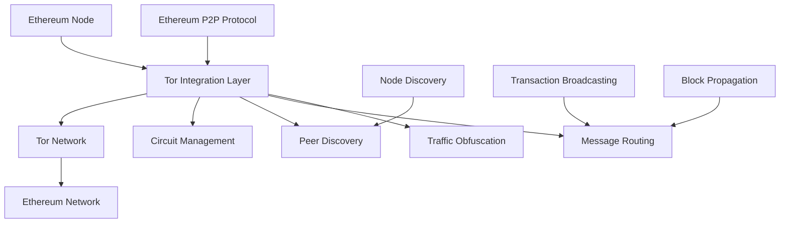

# Provide Privacy to the Ethereum Networking Layer using Tor

> **📢 ATTRIBUTION: This project idea originated from the Tor Project's blockchain privacy initiative**
> 
> **Focus: Integrating Tor's anonymity network with Ethereum's peer-to-peer networking layer to provide privacy for node operators and users**

---

## Overview

A project to integrate Tor's anonymity network with Ethereum's peer-to-peer networking layer, providing privacy protection for node operators, transaction broadcasters, and network participants. This initiative addresses the critical privacy vulnerabilities in Ethereum's current networking stack, where node IP addresses, network topology, and transaction origins can be easily traced and correlated.

## Problem Statement

Ethereum's current peer-to-peer networking layer exposes significant privacy vulnerabilities. Node operators' IP addresses are publicly visible, allowing for network mapping, targeted attacks, and deanonymization. Transaction broadcasters can be traced to their source nodes, enabling correlation attacks and privacy breaches. Network topology analysis reveals the structure of the Ethereum network, making it vulnerable to targeted censorship and attacks. This project aims to solve these issues by routing all Ethereum networking traffic through Tor's proven anonymity network.

## Proposed Solution

### Core Components

1. **Tor-Integrated Ethereum Client**
   - **Modified Geth/Nethermind**: Ethereum clients with built-in Tor support
   - **Anonymous Node Discovery**: Tor-based peer discovery mechanisms
   - **Encrypted Peer Communication**: All P2P traffic routed through Tor
   - **Circuit Management**: Automatic Tor circuit rotation for Ethereum nodes

2. **Privacy-Enhanced Networking Protocol**
   - **Anonymous Peer IDs**: Tor-based peer identification without IP correlation
   - **Encrypted Message Routing**: All Ethereum protocol messages through Tor
   - **Traffic Obfuscation**: Hide Ethereum networking patterns
   - **Sybil Resistance**: Maintain network security while preserving privacy

3. **Network Privacy Features**
   - **Transaction Anonymity**: Hide transaction broadcast sources
   - **Block Propagation Privacy**: Anonymous block sharing
   - **State Sync Privacy**: Private state synchronization
   - **Network Topology Obfuscation**: Hide node relationships

## Technical Architecture

### System Architecture


### Tor-Integrated Ethereum Client
```go
// Example Go implementation for Tor-integrated Ethereum client
package ethereum

import (
    "github.com/ethereum/go-ethereum/p2p"
    "github.com/ethereum/go-ethereum/p2p/discover"
    "github.com/ethereum/go-ethereum/p2p/enode"
    "github.com/ethereum/go-ethereum/p2p/enr"
    "tor/integration"
)

type TorEthereumNode struct {
    torClient    *tor.Client
    p2pServer    *p2p.Server
    peerManager  *TorPeerManager
    circuitMgr   *CircuitManager
}

type TorPeerManager struct {
    torClient    *tor.Client
    peerStore    map[enode.ID]*TorPeer
    circuitMap   map[string]*tor.Circuit
}

func NewTorEthereumNode(config *Config) (*TorEthereumNode, error) {
    // Initialize Tor client
    torClient, err := tor.NewClient(&tor.Config{
        DataDir:     config.TorDataDir,
        ControlPort: config.TorControlPort,
        SocksPort:   config.TorSocksPort,
        MaxCircuits: 10,
    })
    if err != nil {
        return nil, err
    }
    
    // Create P2P server with Tor integration
    p2pServer := &p2p.Server{
        Config: p2p.Config{
            PrivateKey: config.NodeKey,
            Name:       config.NodeName,
            Protocols:  config.Protocols,
            ListenAddr: ":0", // Let Tor handle networking
        },
    }
    
    return &TorEthereumNode{
        torClient:   torClient,
        p2pServer:   p2pServer,
        peerManager: NewTorPeerManager(torClient),
        circuitMgr:  NewCircuitManager(torClient),
    }, nil
}

func (n *TorEthereumNode) Start() error {
    // Start Tor client
    if err := n.torClient.Start(); err != nil {
        return err
    }
    
    // Create onion service for Ethereum P2P
    onionService, err := n.torClient.CreateOnionService(&tor.OnionConfig{
        Port:    30303, // Ethereum P2P port
        Version: 3,
    })
    if err != nil {
        return err
    }
    
    // Start P2P server through Tor
    if err := n.p2P2Server.Start(); err != nil {
        return err
    }
    
    // Start peer discovery through Tor
    go n.startTorPeerDiscovery()
    
    return nil
}

func (n *TorEthereumNode) startTorPeerDiscovery() {
    // Use Tor for peer discovery
    for {
        // Get random Tor circuit
        circuit := n.circuitMgr.GetRandomCircuit()
        
        // Discover peers through Tor
        peers := n.discoverPeersThroughTor(circuit)
        
        // Connect to peers through Tor
        for _, peer := range peers {
            n.connectToPeerThroughTor(peer, circuit)
        }
        
        // Rotate circuits periodically
        time.Sleep(30 * time.Second)
        n.circuitMgr.RotateCircuits()
    }
}

func (n *TorEthereumNode) discoverPeersThroughTor(circuit *tor.Circuit) []*enode.Node {
    // Use Tor circuit for peer discovery
    // This prevents correlation between discovery requests and node identity
    
    // Create anonymous discovery request
    discoveryReq := &discover.Ping{
        Version:    4,
        From:       n.p2pServer.LocalNode(),
        To:         nil, // Will be filled by Tor routing
        Expiration: uint64(time.Now().Add(10 * time.Second).Unix()),
    }
    
    // Route through Tor circuit
    response, err := n.torClient.SendThroughCircuit(circuit, discoveryReq)
    if err != nil {
        return nil
    }
    
    // Parse peer list from response
    return n.parsePeerList(response)
}

func (n *TorEthereumNode) connectToPeerThroughTor(peer *enode.Node, circuit *tor.Circuit) error {
    // Connect to peer through Tor circuit
    // This ensures all communication is anonymous
    
    // Create connection through Tor
    conn, err := n.torClient.DialThroughCircuit(circuit, peer.IP(), peer.TCP())
    if err != nil {
        return err
    }
    
    // Establish P2P connection
    p2pConn := p2p.NewConn(conn, peer, n.p2pServer)
    
    // Add to peer manager
    n.peerManager.AddPeer(peer.ID(), p2pConn, circuit)
    
    return nil
}
```

### Privacy-Enhanced Message Routing
```rust
// Example Rust implementation for privacy-enhanced message routing
use ethereum_p2p::{Message, PeerId, NetworkConfig};
use tor_client::{TorClient, Circuit, OnionService};

pub struct PrivacyEnhancedRouter {
    tor_client: TorClient,
    message_queue: VecDeque<QueuedMessage>,
    circuit_pool: CircuitPool,
}

impl PrivacyEnhancedRouter {
    pub async fn route_message(&mut self, message: Message, target: PeerId) -> Result<(), RouterError> {
        // Get available circuit
        let circuit = self.circuit_pool.get_available_circuit().await?;
        
        // Anonymize message
        let anonymous_message = self.anonymize_message(message, circuit.id()).await?;
        
        // Route through Tor circuit
        let result = self.tor_client.send_through_circuit(
            circuit,
            target,
            anonymous_message
        ).await;
        
        // Handle result
        match result {
            Ok(_) => {
                // Message sent successfully
                self.circuit_pool.mark_circuit_used(circuit.id()).await;
                Ok(())
            }
            Err(e) => {
                // Circuit failed, try another
                self.circuit_pool.mark_circuit_failed(circuit.id()).await;
                Err(RouterError::CircuitFailed(e))
            }
        }
    }
    
    async fn anonymize_message(&self, message: Message, circuit_id: u64) -> Result<Vec<u8>, AnonymizationError> {
        // Remove identifying information from message
        let mut anonymous_message = message.clone();
        
        // Anonymize source information
        anonymous_message.source = PeerId::random(); // Use random peer ID
        
        // Add circuit identifier for routing
        anonymous_message.metadata.insert("circuit_id", circuit_id.to_string());
        
        // Encrypt message content
        let encrypted = self.encrypt_message(anonymous_message).await?;
        
        Ok(encrypted)
    }
    
    async fn encrypt_message(&self, message: Message) -> Result<Vec<u8>, EncryptionError> {
        // Encrypt message using circuit-specific key
        let key = self.generate_circuit_key(message.metadata.get("circuit_id")).await?;
        
        // Encrypt message content
        let encrypted = self.encrypt_with_key(&message.content, &key).await?;
        
        Ok(encrypted)
    }
}
```

### Circuit Management and Rotation
```typescript
// Example TypeScript implementation for circuit management
import { TorClient, Circuit, CircuitConfig } from '@tor/client';

class CircuitManager {
    private torClient: TorClient;
    private activeCircuits: Map<string, Circuit>;
    private circuitPool: Circuit[];
    private rotationInterval: NodeJS.Timeout;
    
    constructor(torClient: TorClient) {
        this.torClient = torClient;
        this.activeCircuits = new Map();
        this.circuitPool = [];
        this.startCircuitRotation();
    }
    
    async createCircuit(): Promise<Circuit> {
        const config: CircuitConfig = {
            anonymityLevel: 'high',
            maxHops: 3,
            timeout: 30000,
            excludeNodes: [], // Exclude compromised nodes
        };
        
        const circuit = await this.torClient.createCircuit(config);
        
        // Add to pool
        this.circuitPool.push(circuit);
        
        return circuit;
    }
    
    async getCircuit(): Promise<Circuit> {
        // Get available circuit from pool
        if (this.circuitPool.length === 0) {
            await this.createCircuit();
        }
        
        const circuit = this.circuitPool.pop()!;
        this.activeCircuits.set(circuit.id, circuit);
        
        return circuit;
    }
    
    async rotateCircuits(): Promise<void> {
        // Close old circuits
        for (const [id, circuit] of this.activeCircuits) {
            await circuit.close();
            this.activeCircuits.delete(id);
        }
        
        // Create new circuits
        const newCircuits = await Promise.all([
            this.createCircuit(),
            this.createCircuit(),
            this.createCircuit(),
        ]);
        
        this.circuitPool.push(...newCircuits);
    }
    
    private startCircuitRotation(): void {
        // Rotate circuits every 5 minutes
        this.rotationInterval = setInterval(() => {
            this.rotateCircuits();
        }, 5 * 60 * 1000);
    }
    
    async shutdown(): Promise<void> {
        clearInterval(this.rotationInterval);
        
        // Close all circuits
        for (const circuit of this.activeCircuits.values()) {
            await circuit.close();
        }
        
        for (const circuit of this.circuitPool) {
            await circuit.close();
        }
    }
}
```

## Implementation Roadmap

### Phase 1: Core Tor Integration (4 months)
- Modify Ethereum client networking stack
- Implement Tor client integration
- Create circuit management system
- Develop anonymous peer discovery
- Basic privacy testing

### Phase 2: Protocol Enhancement (3 months)
- Enhance P2P protocol for privacy
- Implement message anonymization
- Add traffic obfuscation
- Create privacy metrics
- Security analysis

### Phase 3: Client Development (3 months)
- Build modified Geth client
- Create modified Nethermind client
- Develop configuration tools
- Add monitoring and debugging
- Performance optimization

### Phase 4: Testing and Deployment (2 months)
- Network testing and validation
- Privacy effectiveness testing
- Community deployment
- Documentation and guides
- Open source release

## Business Model

### Open Source Contribution
- All modifications are open source
- Community-driven development
- Focus on privacy and security
- No licensing fees or restrictions

### Value Proposition
1. **For Node Operators**: Complete network privacy
2. **For Users**: Transaction privacy protection
3. **For Network**: Improved security and resilience
4. **For Ecosystem**: Privacy-first Ethereum networking

## Key Features

### Privacy Features
- **Node Anonymity**: Hide node IP addresses and locations
- **Transaction Privacy**: Anonymous transaction broadcasting
- **Network Topology Privacy**: Hide node relationships
- **Circuit Rotation**: Automatic Tor circuit management
- **Traffic Obfuscation**: Hide Ethereum networking patterns

### Security Features
- **Sybil Resistance**: Maintain network security
- **Encrypted Communication**: All P2P traffic encrypted
- **Circuit Diversity**: Multiple Tor circuits for redundancy
- **Attack Resistance**: Protection against targeted attacks
- **Privacy Auditing**: Comprehensive privacy metrics

### Performance Features
- **Circuit Pooling**: Efficient circuit management
- **Connection Multiplexing**: Multiple connections per circuit
- **Fallback Mechanisms**: Graceful degradation
- **Monitoring Tools**: Performance and privacy metrics
- **Optimization**: Minimal latency overhead

## Target Market

### Primary Users
- Ethereum node operators
- Privacy-conscious users
- DeFi protocol developers
- Privacy advocates
- Security researchers

### Use Cases
- Private Ethereum node operation
- Anonymous transaction broadcasting
- Privacy-enhanced DeFi
- Secure network participation
- Research and development

## Success Metrics

- Number of Tor-integrated nodes
- Privacy protection effectiveness
- Network performance impact
- Security improvements
- Community adoption
- Code contributions
- Privacy audit results

## Competitive Advantages

1. **Privacy**: Complete network-level anonymity
2. **Security**: Enhanced protection against attacks
3. **Compatibility**: Works with existing Ethereum clients
4. **Performance**: Minimal overhead with maximum privacy
5. **Community**: Open source and community-driven
6. **Innovation**: Cutting-edge privacy technology

## Partnership Opportunities

### Technology Partners
- Tor Project development team
- Ethereum client development teams
- Privacy technology organizations
- Academic institutions
- Security research groups

### Community Partners
- Ethereum privacy advocates
- Node operator communities
- DeFi protocol developers
- Privacy rights organizations
- Open source foundations

## Challenges and Mitigation

### Technical Challenges
- **Protocol Compatibility**: Ethereum P2P protocol modifications
  - *Mitigation*: Careful protocol analysis, backward compatibility, extensive testing
- **Performance Impact**: Tor routing adds latency
  - *Mitigation*: Circuit optimization, connection pooling, performance monitoring
- **Network Security**: Maintaining security while adding privacy
  - *Mitigation*: Security audits, gradual rollout, community feedback

### Adoption Challenges
- **Client Modifications**: Changes to existing Ethereum clients
  - *Mitigation*: Minimal changes, clear documentation, community support
- **Performance Expectations**: Users expect fast networking
  - *Mitigation*: Performance optimization, user education, realistic expectations
- **Network Effects**: Privacy benefits increase with adoption
  - *Mitigation*: Clear value proposition, early adopter incentives, community building

## Future Vision

### Near-term Enhancements
- Additional Ethereum client support
- Advanced privacy features
- Mobile node support
- Integration with Layer 2 solutions
- Enhanced monitoring tools

### Long-term Goals
- Universal Ethereum network privacy
- Integration with other blockchain networks
- Advanced anonymity techniques
- Global deployment and adoption
- Standardization of privacy networking

## Community and Governance

- Open source development model
- Community-driven feature development
- Regular security audits and updates
- Transparent development process
- Collaboration with Tor Project team

## References

- [Tor Project](https://www.torproject.org/)
- [Ethereum P2P Networking](https://github.com/ethereum/devp2p)
- [Go Ethereum (Geth)](https://geth.ethereum.org/)
- [Nethermind Ethereum Client](https://nethermind.io/)
- [Ethereum Node Privacy](https://ethereum.org/en/developers/docs/nodes-and-clients/)

