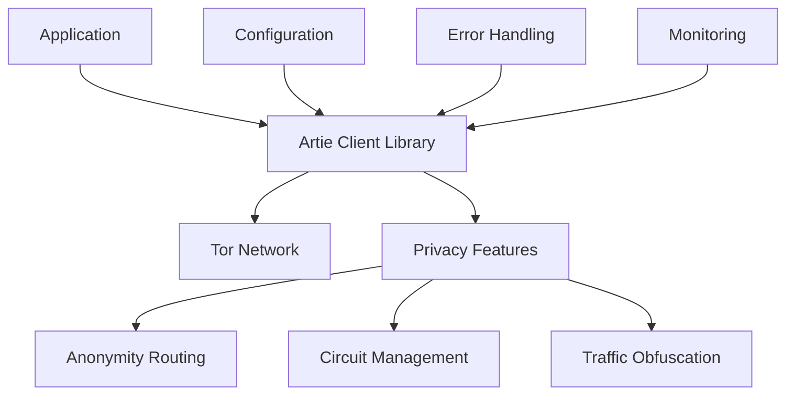

# Integrate Artie API into Real-World Applications

> **📢 ATTRIBUTION: This project idea originated from the Tor Project's Artie API integration challenge**
> 
> **Focus: Building proof-of-concept applications that demonstrate Artie's privacy capabilities**

---

## Overview

A project to integrate Tor's new Rust-based Artie API into real-world applications, demonstrating how developers can easily add privacy features to their apps. This project aims to create working examples that showcase Artie's cleaner developer experience compared to the legacy C codebase, helping shape the API design and accelerate adoption.

## Problem Statement

Tor's legacy C codebase presents significant barriers for application developers who want to integrate privacy features. The complex integration process, lack of modern developer tooling, and steep learning curve prevent many applications from leveraging Tor's anonymity network. The new Rust rewrite (Artie) promises a much cleaner developer experience, but needs real-world testing and examples to prove its value and guide API design decisions.

## Proposed Solution

### Core Components

1. **Proof-of-Concept Applications**
   - **Privacy Wallet**: Cryptocurrency wallet that routes transactions through Tor
   - **Secure Messaging Client**: Chat application with built-in anonymity
   - **Voting Tool**: Democratic voting system with privacy guarantees
   - **File Sharing App**: Secure file transfer with anonymous routing
   - **Social Media Client**: Privacy-focused social networking

2. **Integration Patterns**
   - Minimal code integration examples
   - Performance benchmarks vs. legacy Tor
   - Error handling and fallback strategies
   - Cross-platform compatibility testing
   - Security best practices documentation

3. **Developer Experience Tools**
   - Integration tutorials and guides
   - Sample code repositories
   - Testing frameworks and mock services
   - Performance profiling tools
   - Debugging and monitoring utilities

## Technical Architecture

### Application Examples

#### Privacy Wallet Integration
```rust
// Example Artie integration in a Rust wallet
use artie::client::{ArtieClient, ConnectionConfig};
use artie::privacy::anonymity::AnonymityLevel;

pub struct PrivacyWallet {
    artie_client: ArtieClient,
    wallet_backend: WalletBackend,
}

impl PrivacyWallet {
    pub async fn new() -> Result<Self, ArtieError> {
        let config = ConnectionConfig::default()
            .anonymity_level(AnonymityLevel::High)
            .circuit_timeout(Duration::from_secs(30));
            
        let artie_client = ArtieClient::connect(config).await?;
        
        Ok(Self {
            artie_client,
            wallet_backend: WalletBackend::new(),
        })
    }
    
    pub async fn send_transaction(&self, tx: Transaction) -> Result<TxHash, WalletError> {
        // Route transaction through Artie's privacy network
        let anonymous_tx = self.artie_client.anonymize_transaction(tx).await?;
        
        // Submit to blockchain through anonymous connection
        let tx_hash = self.wallet_backend.submit_transaction(anonymous_tx).await?;
        
        Ok(tx_hash)
    }
}
```

#### Secure Messaging Client
```typescript
// Example Artie integration in a TypeScript messaging app
import { ArtieClient } from '@artie/client';

class SecureMessenger {
    private artieClient: ArtieClient;
    
    constructor() {
        this.artieClient = new ArtieClient({
            anonymityLevel: 'high',
            circuitTimeout: 30000,
            maxRetries: 3
        });
    }
    
    async sendMessage(recipient: string, message: string): Promise<void> {
        // Encrypt message
        const encrypted = await this.encryptMessage(message, recipient);
        
        // Route through Artie's privacy network
        const anonymousMessage = await this.artieClient.anonymizeMessage({
            content: encrypted,
            recipient,
            timestamp: Date.now()
        });
        
        // Send through anonymous channel
        await this.transmitMessage(anonymousMessage);
    }
    
    async receiveMessages(): Promise<Message[]> {
        // Listen for incoming messages through anonymous channel
        const messages = await this.artieClient.listenForMessages();
        return messages.map(msg => this.decryptMessage(msg));
    }
}
```

### Integration Architecture


## Implementation Roadmap

### Phase 1: Core Integration (2 months)
- Set up Artie development environment
- Create basic client library wrapper
- Implement core privacy features
- Build simple test applications
- Document integration patterns

### Phase 2: Application Development (3 months)
- Develop privacy wallet prototype
- Create secure messaging client
- Build voting tool demonstration
- Implement file sharing application
- Add social media client example

### Phase 3: Developer Experience (2 months)
- Create comprehensive tutorials
- Build testing frameworks
- Develop monitoring tools
- Write integration guides
- Create sample repositories

### Phase 4: Community Engagement (1 month)
- Open source all examples
- Create developer documentation
- Host integration workshops
- Gather community feedback
- Contribute to Artie API design

## Business Model

### Open Source Contribution
- All integration examples are open source
- Developer tools and libraries are freely available
- Tutorials and documentation are community resources
- Focus on ecosystem growth rather than monetization

### Value Proposition
1. **For Developers**: Easy privacy integration, better user experience
2. **For Users**: Privacy-focused applications, better security
3. **For Tor Project**: Real-world feedback, accelerated adoption
4. **For Ecosystem**: More privacy-aware applications

## Key Features

### Privacy Features
- **Anonymous Routing**: All traffic routed through Tor network
- **Circuit Management**: Automatic circuit creation and rotation
- **Traffic Obfuscation**: Hide Tor usage patterns
- **Identity Protection**: Prevent deanonymization attacks
- **Fallback Handling**: Graceful degradation when Tor unavailable

### Developer Features
- **Simple API**: Minimal code required for privacy
- **Cross-Platform**: Support for multiple programming languages
- **Error Handling**: Comprehensive error management
- **Monitoring**: Built-in metrics and debugging
- **Testing**: Mock services and test frameworks

### Application Features
- **Wallet Privacy**: Anonymous cryptocurrency transactions
- **Secure Messaging**: End-to-end encrypted communication
- **Voting Privacy**: Anonymous democratic participation
- **File Sharing**: Secure anonymous file transfer
- **Social Privacy**: Privacy-focused social networking

## Target Market

### Primary Users
- Application developers seeking privacy features
- Privacy-focused application users
- Organizations requiring anonymity
- Human rights activists and journalists
- General users concerned about privacy

### Application Categories
- Financial applications (wallets, banking)
- Communication tools (messaging, email)
- Social platforms (networking, forums)
- File sharing and storage
- Voting and governance systems

## Success Metrics

- Number of applications integrated
- Developer adoption rate
- User engagement with privacy features
- Performance improvements over legacy Tor
- Community contributions and feedback
- API design improvements contributed
- Documentation quality and usage

## Competitive Advantages

1. **Modern API**: Rust-based, developer-friendly design
2. **Performance**: Better performance than legacy C codebase
3. **Integration**: Easier integration with modern applications
4. **Documentation**: Comprehensive examples and tutorials
5. **Community**: Active development and support
6. **Standards**: Built on proven Tor privacy technology

## Partnership Opportunities

### Technology Partners
- Tor Project development team
- Privacy-focused organizations
- Open source communities
- Security researchers
- Application developers

### Community Partners
- Developer advocacy groups
- Privacy rights organizations
- Open source foundations
- Academic institutions
- Security conferences

## Challenges and Mitigation

### Technical Challenges
- **API Stability**: Early API changes may break integrations
  - *Mitigation*: Version compatibility layers, clear deprecation policies
- **Performance**: Ensuring privacy doesn't significantly impact performance
  - *Mitigation*: Optimized routing, connection pooling, caching
- **Reliability**: Handling network failures and censorship
  - *Mitigation*: Fallback mechanisms, circuit rotation, error recovery

### Adoption Challenges
- **Developer Education**: Learning curve for privacy concepts
  - *Mitigation*: Clear tutorials, examples, community support
- **Performance Expectations**: Users expect fast applications
  - *Mitigation*: Optimized routing, background processing
- **Security Concerns**: Ensuring privacy doesn't compromise security
  - *Mitigation*: Security audits, best practices, testing

## Future Vision

### Near-term Enhancements
- Mobile application support
- Real-time communication features
- Advanced anonymity techniques
- Performance optimizations
- Additional application examples

### Long-term Goals
- Mainstream privacy adoption
- Integration with major platforms
- Advanced privacy features
- Global censorship resistance
- Privacy-by-default applications

## Community and Governance

- Open source development model
- Community-driven feature requests
- Regular contributor meetings
- Transparent development process
- Collaboration with Tor Project team

## References

- [Tor Project Artie Documentation](https://gitlab.torproject.org/tpo/core/artie)
- [Tor Privacy Technology](https://www.torproject.org/)
- [Rust Programming Language](https://www.rust-lang.org/)
- [Privacy-First Development](https://privacy-first-development.org/)
