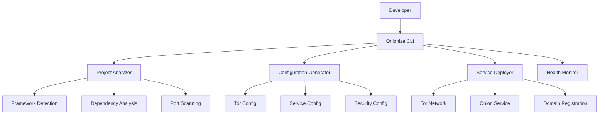

# Onion Service Developer Tooling

> **📢 ATTRIBUTION: This project idea originated from the Tor Project's onion service development initiative**
> 
> **Focus: Building developer tools, wrappers, and SDKs to simplify onion service deployment and integration**

---

## Overview

A project to create comprehensive developer tooling that makes deploying and integrating onion services (.onion) simple and accessible. This initiative addresses the significant barrier that complex onion service setup presents to developers, enabling new use cases such as chat applications, marketplaces, and microservices while growing the Tor application ecosystem.

## Problem Statement

Onion services (.onion) offer strong anonymity and privacy guarantees but are notoriously difficult to set up and integrate into applications. The complex configuration requirements, lack of developer-friendly tools, and steep learning curve prevent many developers from adopting onion services. This barrier blocks new use cases like privacy-focused chat apps, decentralized marketplaces, and anonymous microservices. The project aims to lower this barrier through comprehensive tooling and documentation.

## Proposed Solution

### Core Components

1. **CLI Tools and Wrappers**
   - **"Onionize" CLI**: Simple command to convert existing servers
   - **Service Generator**: Scaffold new onion service projects
   - **Configuration Manager**: Automated setup and management
   - **Deployment Tools**: One-click deployment to onion services

2. **SDKs and Libraries**
   - **Node.js SDK**: Easy integration for JavaScript/TypeScript
   - **Python SDK**: Python application integration
   - **Rust SDK**: Systems programming language support
   - **Go SDK**: Go language integration
   - **Mobile SDKs**: iOS and Android support

3. **Development Tools**
   - **Local Testing Environment**: Test onion services locally
   - **Debugging Tools**: Network and service debugging
   - **Monitoring Dashboard**: Service health and metrics
   - **Documentation Generator**: Auto-generated API docs

## Technical Architecture

### CLI Tool Architecture


### CLI Implementation Example
```bash
# Example "onionize" CLI usage
#!/usr/bin/env bash

# Onionize an existing Express.js server
onionize express-server --port 3000 --name "my-chat-app"

# Onionize a Python Flask app
onionize flask-app --port 5000 --name "my-marketplace"

# Onionize a Rust web service
onionize rust-service --port 8080 --name "my-microservice"

# Generate a new onion service project
onionize new --template chat-app --name "privacy-chat"

# Deploy existing service to onion network
onionize deploy --service my-service --env production
```

### Node.js SDK Example
```typescript
// Example Node.js SDK for onion service integration
import { OnionService, OnionConfig } from '@tor/onion-sdk';

class ChatApplication {
    private onionService: OnionService;
    
    constructor() {
        this.onionService = new OnionService({
            name: 'privacy-chat',
            port: 3000,
            version: '3', // Onion service v3
            privateKey: process.env.ONION_PRIVATE_KEY,
            authorizedClients: ['client1', 'client2']
        });
    }
    
    async start(): Promise<void> {
        // Start the onion service
        await this.onionService.start();
        
        console.log(`Chat app available at: ${this.onionService.onionAddress}`);
        
        // Set up Express server
        const app = express();
        app.use(express.json());
        
        // Chat endpoints
        app.post('/api/messages', this.handleMessage.bind(this));
        app.get('/api/messages', this.getMessages.bind(this));
        
        // Start server on onion service
        this.onionService.serve(app);
    }
    
    private async handleMessage(req: Request, res: Response): Promise<void> {
        const { message, sender } = req.body;
        
        // Store message anonymously
        await this.storeMessage({
            content: message,
            timestamp: Date.now(),
            sender: this.onionService.anonymizeId(sender)
        });
        
        res.json({ success: true, messageId: generateId() });
    }
    
    private async getMessages(req: Request, res: Response): Promise<void> {
        const messages = await this.retrieveMessages();
        res.json(messages);
    }
}

// Usage
const chatApp = new ChatApplication();
chatApp.start().catch(console.error);
```

### Python SDK Example
```python
# Example Python SDK for onion service integration
from tor_onion_sdk import OnionService, OnionConfig
from flask import Flask, request, jsonify
import os

class MarketplaceService:
    def __init__(self):
        self.onion_service = OnionService(
            name="privacy-marketplace",
            port=5000,
            version="3",
            private_key=os.getenv("ONION_PRIVATE_KEY"),
            authorized_clients=["vendor1", "vendor2", "buyer1"]
        )
        
        self.app = Flask(__name__)
        self.setup_routes()
    
    def setup_routes(self):
        @self.app.route('/api/listings', methods=['POST'])
        def create_listing():
            data = request.get_json()
            
            # Create anonymous listing
            listing = self.onion_service.anonymize_data({
                'title': data['title'],
                'price': data['price'],
                'description': data['description'],
                'vendor_id': self.onion_service.anonymize_id(data['vendor_id'])
            })
            
            listing_id = self.store_listing(listing)
            return jsonify({'success': True, 'listing_id': listing_id})
        
        @self.app.route('/api/listings', methods=['GET'])
        def get_listings():
            listings = self.retrieve_listings()
            return jsonify(listings)
    
    def start(self):
        # Start the onion service
        self.onion_service.start()
        print(f"Marketplace available at: {self.onion_service.onion_address}")
        
        # Serve Flask app through onion service
        self.onion_service.serve(self.app)

# Usage
if __name__ == "__main__":
    marketplace = MarketplaceService()
    marketplace.start()
```

### Local Development Environment
```yaml
# docker-compose.yml for local onion service development
version: '3.8'
services:
  tor:
    image: dperson/torproxy
    ports:
      - "9050:9050"
      - "9051:9051"
    volumes:
      - ./tor-config:/etc/tor
      - ./onion-keys:/var/lib/tor/keys
    environment:
      - TZ=UTC
  
  onion-service:
    build: .
    ports:
      - "3000:3000"
    environment:
      - TOR_SOCKS_PORT=9050
      - TOR_CONTROL_PORT=9051
      - ONION_SERVICE_NAME=dev-service
    volumes:
      - .:/app
      - ./onion-keys:/app/keys
    depends_on:
      - tor
  
  onion-monitor:
    image: tor-onion-monitor
    ports:
      - "8080:8080"
    environment:
      - TOR_CONTROL_PORT=9051
    depends_on:
      - tor
```

## Implementation Roadmap

### Phase 1: Core CLI Tools (3 months)
- Design CLI interface and commands
- Implement project analysis and detection
- Create configuration generators
- Build basic deployment tools
- Develop local testing environment

### Phase 2: SDK Development (4 months)
- Create Node.js SDK with examples
- Develop Python SDK and integration
- Build Rust SDK for systems programming
- Implement Go SDK for cloud services
- Add mobile SDK support

### Phase 3: Development Tools (3 months)
- Build debugging and monitoring tools
- Create documentation generators
- Implement testing frameworks
- Develop deployment automation
- Add security analysis tools

### Phase 4: Documentation and Community (2 months)
- Create comprehensive tutorials
- Build sample applications
- Write integration guides
- Community feedback integration
- Open source release

## Business Model

### Open Source Contribution
- All tools and SDKs are open source
- Community-driven development and improvement
- Focus on ecosystem growth and adoption
- No licensing fees or restrictions

### Value Proposition
1. **For Developers**: Simple onion service integration
2. **For Applications**: Privacy-focused features and capabilities
3. **For Users**: More anonymous and private applications
4. **For Ecosystem**: Growth of Tor application ecosystem

## Key Features

### CLI Features
- **One-Command Setup**: `onionize my-app` converts existing servers
- **Framework Detection**: Automatic detection of web frameworks
- **Configuration Generation**: Automated Tor and service configuration
- **Deployment Automation**: One-click deployment to onion network
- **Health Monitoring**: Service status and performance monitoring

### SDK Features
- **Simple Integration**: Minimal code changes required
- **Framework Support**: Works with popular web frameworks
- **Security Features**: Built-in anonymity and privacy
- **Error Handling**: Comprehensive error management
- **Testing Support**: Local development and testing tools

### Development Features
- **Local Testing**: Test onion services without Tor network
- **Debugging Tools**: Network and service debugging
- **Documentation**: Auto-generated API documentation
- **Security Analysis**: Vulnerability scanning and analysis
- **Performance Monitoring**: Service metrics and optimization

## Target Market

### Primary Users
- Web application developers
- Backend service developers
- Privacy-focused application creators
- Decentralized application developers
- Security-conscious organizations

### Application Categories
- Chat and messaging applications
- E-commerce and marketplaces
- Social media platforms
- File sharing and storage
- Microservices and APIs

## Success Metrics

- Number of developers using tools
- Applications deployed as onion services
- Developer satisfaction and feedback
- Community contributions
- Documentation quality and usage
- Integration success rate
- Ecosystem growth

## Competitive Advantages

1. **Simplicity**: One-command setup and integration
2. **Comprehensive**: Complete development toolchain
3. **Framework Support**: Works with existing applications
4. **Security**: Built-in privacy and anonymity
5. **Community**: Open source and community-driven
6. **Innovation**: Cutting-edge onion service technology

## Partnership Opportunities

### Technology Partners
- Tor Project development team
- Web framework maintainers
- Cloud service providers
- Security tool developers
- Open source communities

### Community Partners
- Developer advocacy groups
- Privacy technology organizations
- Academic institutions
- Open source foundations
- Security conferences

## Challenges and Mitigation

### Technical Challenges
- **Framework Complexity**: Different frameworks have different architectures
  - *Mitigation*: Modular design, framework-specific adapters, comprehensive testing
- **Configuration Management**: Complex Tor configuration requirements
  - *Mitigation*: Automated configuration generation, validation, and testing
- **Security Requirements**: Onion services have strict security needs
  - *Mitigation*: Security best practices, automated security analysis, community review

### Adoption Challenges
- **Learning Curve**: Developers need to understand onion service concepts
  - *Mitigation*: Clear documentation, examples, tutorials, and community support
- **Performance Concerns**: Onion services may have latency overhead
  - *Mitigation*: Performance optimization, caching, and user education
- **Maintenance Burden**: Keeping tools current with framework updates
  - *Mitigation*: Automated testing, community maintenance, and clear update processes

## Future Vision

### Near-term Enhancements
- Additional framework support
- Mobile application integration
- Cloud deployment automation
- Advanced security features
- Performance optimizations

### Long-term Goals
- Universal onion service adoption
- Integration with major platforms
- Advanced privacy features
- Global deployment and adoption
- Standardization of tooling

## Community and Governance

- Open source development model
- Community-driven feature development
- Regular security audits and updates
- Transparent development process
- Collaboration with Tor Project team

## References

- [Tor Project Onion Services](https://2019.www.torproject.org/docs/onion-services.html.en)
- [Onion Service v3 Specification](https://gitweb.torproject.org/torspec.git/tree/rend-spec-v3.txt)
- [Tor Control Protocol](https://gitweb.torproject.org/torspec.git/tree/control-spec.txt)
- [Web Development Frameworks](https://en.wikipedia.org/wiki/Web_framework)
- [Privacy-First Development](https://privacy-first-development.org/)
