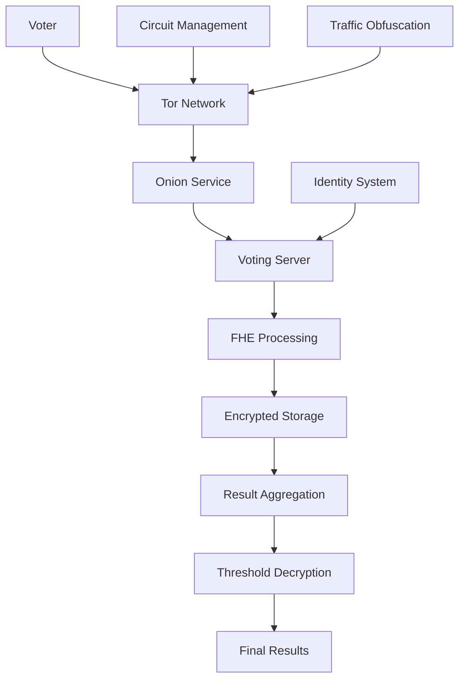

# Private Voting with Tor + FHE

> **📢 ATTRIBUTION: This project idea originated from the Tor Project's privacy and democracy initiative**
> 
> **Focus: Combining Tor's anonymity with FHE for secure, private voting systems**

---

## Overview

A project to create a prototype "Tor ballot box" that combines Tor's anonymity properties with Fully Homomorphic Encryption (FHE) to enable private voting where voter choices remain confidential while ensuring the integrity of the voting process. This system addresses the critical need for democratic participation that preserves both privacy and verifiability.

## Problem Statement

Traditional voting systems face a fundamental privacy-integrity trade-off: verifying unique voter identities without exposing individual choices. While FHE enables private counting and computation on encrypted data, it lacks the network-level anonymity that prevents correlation attacks. Voters can be deanonymized through network traffic analysis, compromising the privacy guarantees of the voting system. This project aims to solve this by integrating Tor's proven anonymity layer with FHE-based voting protocols.

## Proposed Solution

### Core Components

1. **Tor-Anonymized Voting Protocol**
   - All voting traffic routed through Tor network
   - Circuit rotation to prevent traffic correlation
   - Onion service endpoints for voting servers
   - Anonymous voter registration and authentication

2. **FHE-Based Voting Cryptography**
   - Encrypted ballot creation and submission
   - Homomorphic vote counting and aggregation
   - Zero-knowledge proofs for vote validity
   - Threshold decryption for result verification

3. **Privacy-Preserving Identity Management**
   - Anonymous credential systems
   - Blind signature schemes for voter verification
   - Decentralized identity without correlation
   - Sybil resistance mechanisms

## Technical Architecture

### System Architecture


### Voting Protocol Flow
```rust
// Example FHE voting protocol with Tor integration
use fhe::prelude::*;
use tor_client::TorClient;

pub struct TorVotingSystem {
    fhe_context: FheContext,
    tor_client: TorClient,
    voting_server: OnionService,
}

impl TorVotingSystem {
    pub async fn cast_vote(&self, ballot: EncryptedBallot) -> Result<VoteReceipt, VotingError> {
        // Route through Tor network to prevent deanonymization
        let anonymous_connection = self.tor_client.create_circuit().await?;
        
        // Submit encrypted ballot through anonymous channel
        let receipt = self.voting_server
            .submit_vote(ballot, anonymous_connection)
            .await?;
            
        Ok(receipt)
    }
    
    pub async fn process_votes(&self, encrypted_votes: Vec<EncryptedBallot>) -> Result<VoteCounts, ProcessingError> {
        // Use FHE to compute on encrypted votes
        let encrypted_counts = self.fhe_context
            .homomorphic_sum(encrypted_votes)
            .await?;
            
        // Apply threshold decryption
        let final_counts = self.threshold_decrypt(encrypted_counts).await?;
        
        Ok(final_counts)
    }
}

// Encrypted ballot structure
#[derive(FheEncrypt, FheDecrypt)]
pub struct EncryptedBallot {
    pub voter_id: FheUint64,      // Encrypted voter identifier
    pub choice: FheUint8,         // Encrypted vote choice
    pub timestamp: FheUint64,     // Encrypted timestamp
    pub proof: ZeroKnowledgeProof, // Validity proof
}
```

### Identity Management
```typescript
// Anonymous credential system for voter verification
class AnonymousVoterCredential {
    private torClient: TorClient;
    private credentialSystem: CredentialSystem;
    
    async registerVoter(identityProof: IdentityProof): Promise<AnonymousCredential> {
        // Create anonymous credential through Tor
        const anonymousConnection = await this.torClient.createCircuit();
        
        // Generate blind signature for voter verification
        const credential = await this.credentialSystem.issueCredential({
            identityProof,
            anonymityLevel: 'maximum',
            circuitId: anonymousConnection.id
        });
        
        return credential;
    }
    
    async verifyVoter(credential: AnonymousCredential): Promise<boolean> {
        // Verify credential without revealing identity
        const isValid = await this.credentialSystem.verifyCredential(credential);
        
        // Check for double-voting prevention
        const hasVoted = await this.checkVotingHistory(credential.hash);
        
        return isValid && !hasVoted;
    }
}
```

## Implementation Roadmap

### Phase 1: Core Protocol Design (3 months)
- Design Tor-FHE integration architecture
- Implement basic FHE voting primitives
- Create anonymous credential system
- Develop circuit management for voting
- Security analysis and threat modeling

### Phase 2: Prototype Development (4 months)
- Build voting server with onion service
- Implement FHE vote processing
- Create voter client with Tor integration
- Develop identity verification system
- Add result aggregation and verification

### Phase 3: Testing and Validation (2 months)
- Security audit and penetration testing
- Performance testing under load
- Usability testing with real users
- Network anonymity validation
- Cryptographic correctness verification

### Phase 4: Documentation and Deployment (1 month)
- Create comprehensive design notes
- Write deployment and usage guides
- Open source the implementation
- Community feedback integration
- Future enhancement planning

## Business Model

### Open Source Contribution
- Complete voting system is open source
- All cryptographic protocols are publicly auditable
- Community-driven development and improvement
- Focus on democratic access and transparency

### Value Proposition
1. **For Voters**: Complete privacy with verifiable results
2. **For Organizations**: Secure, auditable voting systems
3. **For Democracy**: Enhanced participation with privacy protection
4. **For Research**: Advances in privacy-preserving cryptography

## Key Features

### Privacy Features
- **Network Anonymity**: All traffic routed through Tor
- **Vote Confidentiality**: FHE ensures votes remain encrypted
- **Identity Protection**: Anonymous credential system
- **Traffic Obfuscation**: Circuit rotation and mixing
- **Correlation Resistance**: Prevents deanonymization attacks

### Security Features
- **Cryptographic Integrity**: FHE-based vote processing
- **Verifiable Results**: Threshold decryption and proofs
- **Sybil Resistance**: Anonymous credential verification
- **Audit Trail**: Complete voting record without privacy loss
- **Tamper Detection**: Cryptographic integrity checks

### Voting Features
- **Multiple Choice**: Support for complex voting schemes
- **Real-time Results**: Live encrypted vote counting
- **Result Verification**: Cryptographic proof of correctness
- **Voter Authentication**: Anonymous but verifiable identity
- **Audit Support**: Complete transparency without privacy loss

## Target Market

### Primary Users
- Democratic organizations and governments
- Corporate governance and shareholder voting
- Academic and research institutions
- Non-profit organizations and associations
- Online communities and DAOs

### Use Cases
- National and local elections
- Corporate board elections
- Academic faculty voting
- Community governance decisions
- Research participant surveys

## Success Metrics

- Cryptographic security validation
- Network anonymity verification
- Performance under realistic load
- User adoption and satisfaction
- Security audit results
- Community contributions
- Real-world deployment success

## Competitive Advantages

1. **Privacy**: Unprecedented level of vote confidentiality
2. **Integrity**: Cryptographic guarantees of result correctness
3. **Anonymity**: Network-level protection against correlation
4. **Verifiability**: Complete audit trail without privacy loss
5. **Scalability**: FHE enables efficient encrypted computation
6. **Transparency**: Open source and auditable implementation

## Partnership Opportunities

### Technology Partners
- Tor Project development team
- FHE research institutions
- Cryptography experts and auditors
- Privacy technology organizations
- Academic research partners

### Community Partners
- Democratic governance organizations
- Human rights and privacy groups
- Academic institutions
- Open source foundations
- Government technology initiatives

## Challenges and Mitigation

### Technical Challenges
- **FHE Performance**: Homomorphic operations are computationally expensive
  - *Mitigation*: Optimized algorithms, hardware acceleration, batching
- **Network Latency**: Tor routing adds latency to voting
  - *Mitigation*: Circuit optimization, background processing, user education
- **Key Management**: Secure distribution of threshold keys
  - *Mitigation*: Multi-party computation, hardware security modules

### Security Challenges
- **Cryptographic Attacks**: New attacks on FHE schemes
  - *Mitigation*: Regular security audits, multiple FHE schemes, expert review
- **Network Attacks**: Tor network vulnerabilities
  - *Mitigation*: Circuit diversity, fallback mechanisms, monitoring
- **Identity Attacks**: Sybil and credential forgery
  - *Mitigation*: Strong cryptographic primitives, rate limiting, verification

## Future Vision

### Near-term Enhancements
- Mobile voting applications
- Advanced voting schemes (ranked choice, approval)
- Real-time result visualization
- Integration with existing voting systems
- Performance optimizations

### Long-term Goals
- Mainstream adoption in elections
- Integration with government systems
- Advanced privacy features
- Global deployment and adoption
- Standardization of protocols

## Community and Governance

- Open source development model
- Academic collaboration and peer review
- Regular security audits and updates
- Community-driven feature development
- Transparent cryptographic design

## References

- [Tor Project](https://www.torproject.org/)
- [Fully Homomorphic Encryption](https://en.wikipedia.org/wiki/Homomorphic_encryption)
- [Zero-Knowledge Proofs](https://en.wikipedia.org/wiki/Zero-knowledge_proof)
- [Anonymous Credentials](https://en.wikipedia.org/wiki/Anonymous_credential)
- [Threshold Cryptography](https://en.wikipedia.org/wiki/Threshold_cryptosystem)
