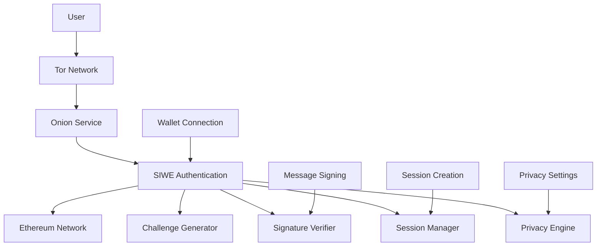

# Integrate Sign-in-with-Ethereum in Onion Services

> **📢 ATTRIBUTION: This project idea originated from the Login.xyz project for Web3 authentication**
> 
> **Login.xyz Documentation: https://docs.login.xyz/**
> 
> **Focus: Integrating Sign-in-with-Ethereum (SIWE) authentication with Tor onion services to provide secure, privacy-preserving Web3 authentication**

---

## Overview

A project to integrate Sign-in-with-Ethereum (SIWE) authentication with Tor onion services, enabling secure and privacy-preserving Web3 authentication for users accessing privacy-focused applications. This initiative addresses the critical need for decentralized identity and authentication in the privacy ecosystem, allowing users to prove ownership of Ethereum addresses while maintaining complete anonymity through Tor's onion service network.

## Problem Statement

Privacy-focused applications running on onion services currently lack robust authentication mechanisms that preserve user anonymity. Traditional authentication systems require users to reveal personal information, compromising the privacy guarantees that onion services provide. Web3 authentication through SIWE offers a solution but needs integration with the Tor network to maintain privacy. Users need a way to authenticate with Ethereum addresses without exposing their real-world identities or network locations, enabling secure access to privacy-focused applications while maintaining complete anonymity.

## Proposed Solution

### Core Components

1. **SIWE-Enhanced Onion Services**
   - **Privacy-Preserving Authentication**: SIWE integration that maintains user anonymity
   - **Onion Service Integration**: Native SIWE support for .onion domains
   - **Anonymous Identity Management**: User identity verification without deanonymization
   - **Session Management**: Secure session handling for authenticated users

2. **Privacy-First Authentication Flow**
   - **Tor-Routed Authentication**: All authentication traffic routed through Tor
   - **Anonymous Challenge Generation**: Privacy-preserving authentication challenges
   - **Zero-Knowledge Verification**: Identity verification without revealing personal data
   - **Circuit-Based Sessions**: Session management through Tor circuits

3. **Enhanced Security Features**
   - **Sybil Resistance**: Protection against identity-based attacks
   - **Session Rotation**: Automatic session rotation for enhanced privacy
   - **Attack Detection**: Detection and prevention of authentication attacks
   - **Privacy Auditing**: Comprehensive privacy and security monitoring

## Technical Architecture

### System Architecture


### SIWE Integration Implementation
```typescript
// Example TypeScript implementation for SIWE integration with onion services
import { SIWE } from 'siwe';
import { TorClient, OnionService } from '@tor/onion-sdk';
import { ethers } from 'ethers';

class SIWEOnionService {
    private onionService: OnionService;
    private torClient: TorClient;
    private siweManager: SIWEManager;
    private sessionManager: SessionManager;
    private privacyEngine: PrivacyEngine;
    
    constructor(config: SIWEOnionConfig) {
        this.onionService = new OnionService({
            name: config.serviceName,
            port: config.port,
            version: '3',
            privateKey: config.onionPrivateKey,
        });
        
        this.torClient = new TorClient({
            dataDir: config.torDataDir,
            controlPort: config.torControlPort,
            socksPort: config.torSocksPort,
        });
        
        this.siweManager = new SIWEManager(config.siweConfig);
        this.sessionManager = new SessionManager(config.sessionConfig);
        this.privacyEngine = new PrivacyEngine(this.torClient);
        
        this.setupEndpoints();
    }
    
    private setupEndpoints(): void {
        // SIWE authentication endpoint
        this.onionService.post('/api/auth/siwe', async (req, res) => {
            try {
                const { address, signature, message } = req.body;
                
                // Verify SIWE signature
                const isValid = await this.siweManager.verifySignature(address, signature, message);
                
                if (isValid) {
                    // Create anonymous session
                    const session = await this.createAnonymousSession(address, req);
                    
                    // Return session token
                    res.json({
                        success: true,
                        sessionToken: session.token,
                        expiresAt: session.expiresAt,
                        privacyLevel: session.privacyLevel
                    });
                } else {
                    res.status(401).json({
                        success: false,
                        error: 'Invalid signature'
                    });
                }
            } catch (error) {
                res.status(500).json({
                    success: false,
                    error: error.message
                });
            }
        });
        
        // SIWE challenge generation endpoint
        this.onionService.post('/api/auth/challenge', async (req, res) => {
            try {
                const { address } = req.body;
                
                // Generate privacy-preserving challenge
                const challenge = await this.generatePrivacyChallenge(address, req);
                
                res.json({
                    success: true,
                    challenge: challenge.message,
                    nonce: challenge.nonce,
                    issuedAt: challenge.issuedAt,
                    expiresAt: challenge.expiresAt
                });
            } catch (error) {
                res.status(500).json({
                    success: false,
                    error: error.message
                });
            }
        });
        
        // Session validation endpoint
        this.onionService.get('/api/auth/session/:token', async (req, res) => {
            try {
                const { token } = req.params;
                
                // Validate session through Tor
                const session = await this.validateSession(token, req);
                
                if (session) {
                    res.json({
                        success: true,
                        session: {
                            address: session.anonymousAddress,
                            privacyLevel: session.privacyLevel,
                            expiresAt: session.expiresAt,
                            lastActivity: session.lastActivity
                        }
                    });
                } else {
                    res.status(401).json({
                        success: false,
                        error: 'Invalid or expired session'
                    });
                }
            } catch (error) {
                res.status(500).json({
                    success: false,
                    error: error.message
                });
            }
        });
    }
    
    async start(): Promise<void> {
        // Start Tor client
        await this.torClient.start();
        
        // Start onion service
        await this.onionService.start();
        
        console.log(`SIWE Onion Service available at: ${this.onionService.onionAddress}`);
    }
    
    private async generatePrivacyChallenge(address: string, req: any): Promise<SIWEChallenge> {
        // Get Tor circuit for this request
        const circuit = await this.getRequestCircuit(req);
        
        // Generate SIWE message with privacy enhancements
        const message = new SIWE.Message({
            domain: this.onionService.onionAddress,
            address: address,
            statement: 'Sign in to access the privacy-focused application',
            uri: `http://${this.onionService.onionAddress}/auth`,
            version: '1',
            chainId: 1, // Ethereum mainnet
            nonce: await this.generatePrivacyNonce(circuit),
            issuedAt: new Date().toISOString(),
            expirationTime: new Date(Date.now() + 5 * 60 * 1000).toISOString(), // 5 minutes
            resources: [
                `http://${this.onionService.onionAddress}/privacy-policy`,
                `http://${this.onionService.onionAddress}/terms`
            ]
        });
        
        // Add privacy metadata
        const privacyChallenge = {
            message: message.prepareMessage(),
            nonce: message.nonce,
            issuedAt: message.issuedAt,
            expiresAt: message.expirationTime,
            circuitId: circuit.id,
            privacyLevel: 'maximum'
        };
        
        return privacyChallenge;
    }
    
    private async createAnonymousSession(address: string, req: any): Promise<AnonymousSession> {
        // Get Tor circuit for this request
        const circuit = await this.getRequestCircuit(req);
        
        // Generate anonymous session identifier
        const sessionId = await this.generateAnonymousSessionId(address, circuit);
        
        // Create session with privacy features
        const session = await this.sessionManager.createSession({
            id: sessionId,
            address: address,
            anonymousAddress: await this.privacyEngine.anonymizeAddress(address, circuit),
            circuitId: circuit.id,
            privacyLevel: 'maximum',
            createdAt: new Date(),
            expiresAt: new Date(Date.now() + 24 * 60 * 60 * 1000), // 24 hours
            lastActivity: new Date()
        });
        
        return session;
    }
    
    private async validateSession(token: string, req: any): Promise<AnonymousSession | null> {
        // Get Tor circuit for this request
        const circuit = await this.getRequestCircuit(req);
        
        // Validate session through Tor
        const session = await this.sessionManager.validateSession(token, circuit);
        
        if (session) {
            // Update session activity
            await this.sessionManager.updateSessionActivity(token);
            
            // Rotate circuit for enhanced privacy
            await this.rotateSessionCircuit(session, circuit);
        }
        
        return session;
    }
    
    private async getRequestCircuit(req: any): Promise<Circuit> {
        // Extract circuit information from request
        const circuitId = req.headers['x-tor-circuit-id'];
        
        if (circuitId) {
            return await this.torClient.getCircuit(circuitId);
        } else {
            // Create new circuit for this request
            return await this.torClient.createCircuit();
        }
    }
    
    private async generatePrivacyNonce(circuit: Circuit): Promise<string> {
        // Generate nonce that includes circuit information for privacy
        const circuitHash = await this.torClient.getCircuitHash(circuit);
        const timestamp = Date.now();
        const randomBytes = crypto.randomBytes(16);
        
        const nonceData = `${circuitHash}-${timestamp}-${randomBytes.toString('hex')}`;
        return crypto.createHash('sha256').update(nonceData).digest('hex');
    }
    
    private async generateAnonymousSessionId(address: string, circuit: Circuit): Promise<string> {
        // Generate session ID that doesn't reveal user identity
        const addressHash = crypto.createHash('sha256').update(address).digest('hex');
        const circuitHash = await this.torClient.getCircuitHash(circuit);
        const timestamp = Date.now();
        
        const sessionData = `${addressHash}-${circuitHash}-${timestamp}`;
        return crypto.createHash('sha256').update(sessionData).digest('hex');
    }
    
    private async rotateSessionCircuit(session: AnonymousSession, oldCircuit: Circuit): Promise<void> {
        // Create new circuit for session
        const newCircuit = await this.torClient.createCircuit();
        
        // Update session with new circuit
        await this.sessionManager.updateSessionCircuit(session.id, newCircuit.id);
        
        // Close old circuit
        await oldCircuit.close();
    }
}

// SIWE Manager for handling authentication
class SIWEManager {
    private config: SIWEConfig;
    
    constructor(config: SIWEConfig) {
        this.config = config;
    }
    
    async verifySignature(address: string, signature: string, message: string): Promise<boolean> {
        try {
            // Parse SIWE message
            const siweMessage = new SIWE.Message(message);
            
            // Verify message format
            if (!siweMessage.validate()) {
                return false;
            }
            
            // Verify signature
            const recoveredAddress = ethers.utils.verifyMessage(siweMessage.prepareMessage(), signature);
            
            // Check if recovered address matches
            if (recoveredAddress.toLowerCase() !== address.toLowerCase()) {
                return false;
            }
            
            // Verify message expiration
            if (siweMessage.expirationTime && new Date() > new Date(siweMessage.expirationTime)) {
                return false;
            }
            
            // Verify domain
            if (siweMessage.domain !== this.config.domain) {
                return false;
            }
            
            return true;
        } catch (error) {
            console.error('SIWE verification error:', error);
            return false;
        }
    }
}

// Session Manager for handling user sessions
class SessionManager {
    private sessions: Map<string, AnonymousSession>;
    private config: SessionConfig;
    
    constructor(config: SessionConfig) {
        this.sessions = new Map();
        this.config = config;
    }
    
    async createSession(sessionData: SessionData): Promise<AnonymousSession> {
        const session: AnonymousSession = {
            id: sessionData.id,
            token: await this.generateSessionToken(sessionData.id),
            address: sessionData.address,
            anonymousAddress: sessionData.anonymousAddress,
            circuitId: sessionData.circuitId,
            privacyLevel: sessionData.privacyLevel,
            createdAt: sessionData.createdAt,
            expiresAt: sessionData.expiresAt,
            lastActivity: sessionData.lastActivity
        };
        
        this.sessions.set(session.token, session);
        
        return session;
    }
    
    async validateSession(token: string, circuit: Circuit): Promise<AnonymousSession | null> {
        const session = this.sessions.get(token);
        
        if (!session) {
            return null;
        }
        
        // Check if session is expired
        if (new Date() > session.expiresAt) {
            this.sessions.delete(token);
            return null;
        }
        
        // Verify circuit matches
        if (session.circuitId !== circuit.id) {
            // Circuit mismatch - potential security issue
            console.warn('Session circuit mismatch detected');
            return null;
        }
        
        return session;
    }
    
    async updateSessionActivity(token: string): Promise<void> {
        const session = this.sessions.get(token);
        if (session) {
            session.lastActivity = new Date();
        }
    }
    
    async updateSessionCircuit(token: string, newCircuitId: string): Promise<void> {
        const session = this.sessions.get(token);
        if (session) {
            session.circuitId = newCircuitId;
        }
    }
    
    private async generateSessionToken(sessionId: string): Promise<string> {
        // Generate cryptographically secure session token
        const randomBytes = crypto.randomBytes(32);
        const sessionData = `${sessionId}-${randomBytes.toString('hex')}`;
        return crypto.createHash('sha256').update(sessionData).digest('hex');
    }
}
```

### Privacy-Enhanced Authentication Flow
```typescript
// Example client-side implementation for privacy-enhanced SIWE authentication
import { SIWE } from 'siwe';
import { ethers } from 'ethers';
import { TorClient } from '@tor/client';

class PrivacyEnhancedSIWEClient {
    private torClient: TorClient;
    private provider: ethers.providers.Web3Provider;
    private signer: ethers.Signer;
    
    constructor() {
        this.torClient = new TorClient({
            dataDir: './tor-data',
            controlPort: 9051,
            socksPort: 9050,
        });
        
        // Initialize Web3 provider
        if (typeof window.ethereum !== 'undefined') {
            this.provider = new ethers.providers.Web3Provider(window.ethereum);
            this.signer = this.provider.getSigner();
        }
    }
    
    async authenticateWithOnionService(onionAddress: string): Promise<AuthenticationResult> {
        try {
            // Connect to Tor network
            await this.torClient.start();
            
            // Create circuit for authentication
            const circuit = await this.torClient.createCircuit();
            
            // Get authentication challenge through Tor
            const challenge = await this.getChallengeThroughTor(onionAddress, circuit);
            
            // Sign challenge with wallet
            const signature = await this.signChallenge(challenge);
            
            // Submit authentication through Tor
            const result = await this.submitAuthenticationThroughTor(
                onionAddress,
                challenge,
                signature,
                circuit
            );
            
            // Store session information
            this.storeSession(result.sessionToken, circuit.id);
            
            return result;
        } catch (error) {
            console.error('Authentication failed:', error);
            throw error;
        }
    }
    
    private async getChallengeThroughTor(onionAddress: string, circuit: Circuit): Promise<SIWEChallenge> {
        // Route request through Tor circuit
        const response = await this.torClient.requestThroughCircuit(circuit, {
            method: 'POST',
            url: `http://${onionAddress}/api/auth/challenge`,
            headers: {
                'Content-Type': 'application/json',
                'X-Tor-Circuit-Id': circuit.id
            },
            body: JSON.stringify({
                address: await this.signer.getAddress()
            })
        });
        
        return response.data;
    }
    
    private async signChallenge(challenge: SIWEChallenge): Promise<string> {
        // Create SIWE message
        const message = new SIWE.Message({
            domain: challenge.domain,
            address: await this.signer.getAddress(),
            statement: challenge.statement,
            uri: challenge.uri,
            version: challenge.version,
            chainId: challenge.chainId,
            nonce: challenge.nonce,
            issuedAt: challenge.issuedAt,
            expirationTime: challenge.expirationTime,
            resources: challenge.resources
        });
        
        // Sign message
        const signature = await this.signer.signMessage(message.prepareMessage());
        
        return signature;
    }
    
    private async submitAuthenticationThroughTor(
        onionAddress: string,
        challenge: SIWEChallenge,
        signature: string,
        circuit: Circuit
    ): Promise<AuthenticationResult> {
        // Submit authentication through Tor circuit
        const response = await this.torClient.requestThroughCircuit(circuit, {
            method: 'POST',
            url: `http://${onionAddress}/api/auth/siwe`,
            headers: {
                'Content-Type': 'application/json',
                'X-Tor-Circuit-Id': circuit.id
            },
            body: JSON.stringify({
                address: await this.signer.getAddress(),
                signature: signature,
                message: challenge.message
            })
        });
        
        return response.data;
    }
    
    private storeSession(sessionToken: string, circuitId: string): void {
        // Store session information securely
        const sessionData = {
            token: sessionToken,
            circuitId: circuitId,
            createdAt: Date.now()
        };
        
        // Store in memory (for demo purposes)
        // In production, use secure storage
        localStorage.setItem('siwe_session', JSON.stringify(sessionData));
    }
    
    async validateSession(onionAddress: string): Promise<boolean> {
        try {
            const sessionData = localStorage.getItem('siwe_session');
            if (!sessionData) {
                return false;
            }
            
            const session = JSON.parse(sessionData);
            
            // Get circuit for validation
            const circuit = await this.torClient.getCircuit(session.circuitId);
            
            // Validate session through Tor
            const response = await this.torClient.requestThroughCircuit(circuit, {
                method: 'GET',
                url: `http://${onionAddress}/api/auth/session/${session.token}`,
                headers: {
                    'X-Tor-Circuit-Id': circuit.id
                }
            });
            
            return response.data.success;
        } catch (error) {
            console.error('Session validation failed:', error);
            return false;
        }
    }
}
```

## Implementation Roadmap

### Phase 1: Core SIWE Integration (3 months)
- Integrate SIWE with onion services
- Implement basic authentication flow
- Create session management system
- Develop privacy enhancements
- Basic security testing

### Phase 2: Privacy Features (3 months)
- Implement Tor routing for authentication
- Add circuit-based session management
- Create privacy-preserving challenges
- Develop anonymous identity management
- Privacy testing and validation

### Phase 3: Security Enhancement (3 months)
- Implement Sybil resistance
- Add attack detection and prevention
- Create session rotation mechanisms
- Develop privacy auditing
- Security analysis and testing

### Phase 4: Testing and Deployment (3 months)
- Integration testing with onion services
- Privacy and security validation
- Performance optimization
- Documentation and guides
- Community deployment

## Business Model

### Open Source Contribution
- All SIWE integration code is open source
- Privacy features are freely available
- Community-driven development
- Focus on user privacy and security

### Value Proposition
1. **For Users**: Privacy-preserving Web3 authentication
2. **For Developers**: Easy SIWE integration for onion services
3. **For Privacy**: Enhanced authentication without deanonymization
4. **For Web3**: Secure authentication in privacy-focused applications

## Key Features

### Authentication Features
- **SIWE Integration**: Full Sign-in-with-Ethereum support
- **Privacy Preservation**: Authentication without deanonymization
- **Session Management**: Secure session handling
- **Circuit Rotation**: Automatic circuit rotation for privacy
- **Fallback Mechanisms**: Graceful degradation when Tor unavailable

### Privacy Features
- **Tor Routing**: All authentication traffic through Tor
- **Anonymous Sessions**: Session management without identity exposure
- **Circuit Isolation**: Separate circuits for different operations
- **Privacy Metrics**: Comprehensive privacy monitoring
- **Zero-Knowledge Verification**: Identity verification without revealing data

### Security Features
- **Sybil Resistance**: Protection against identity-based attacks
- **Attack Detection**: Detection and prevention of authentication attacks
- **Session Security**: Secure session creation and management
- **Privacy Auditing**: Comprehensive security and privacy auditing
- **Secure Storage**: Encrypted session and authentication data

## Target Market

### Primary Users
- Onion service developers
- Privacy-focused application users
- Web3 developers
- Privacy advocates
- Security researchers

### Use Cases
- Privacy-focused social media
- Anonymous marketplaces
- Secure communication platforms
- Privacy-enhanced DeFi
- Anonymous governance systems

## Success Metrics

- Number of onion services using SIWE
- User authentication success rate
- Privacy protection effectiveness
- Security audit results
- Community adoption
- Performance impact
- User satisfaction

## Competitive Advantages

1. **Privacy**: Complete authentication privacy
2. **Integration**: Native onion service support
3. **Security**: Advanced security features
4. **Compatibility**: Works with existing SIWE implementations
5. **Innovation**: Cutting-edge privacy technology
6. **Community**: Open source and community-driven

## Partnership Opportunities

### Technology Partners
- Tor Project development team
- Login.xyz development team
- Web3 authentication providers
- Privacy technology organizations
- Security research groups

### Community Partners
- Privacy rights organizations
- Web3 development communities
- Onion service operators
- Open source foundations
- Privacy advocacy groups

## Challenges and Mitigation

### Technical Challenges
- **SIWE Integration**: Complex integration with onion services
  - *Mitigation*: Careful architecture design, modular integration, extensive testing
- **Performance Impact**: Tor routing adds latency
  - *Mitigation*: Circuit optimization, background processing, user education
- **Session Management**: Complex session handling across circuits
  - *Mitigation*: Robust session management, circuit coordination, fallback mechanisms

### Adoption Challenges
- **User Education**: Complex privacy concepts for non-technical users
  - *Mitigation*: Clear documentation, user tutorials, community support
- **Developer Integration**: Complex integration for developers
  - *Mitigation*: Simple APIs, comprehensive documentation, example implementations
- **Trust Requirements**: Users must trust privacy features
  - *Mitigation*: Open source code, security audits, community review

## Future Vision

### Near-term Enhancements
- Additional authentication methods
- Advanced privacy features
- Mobile application support
- Integration with other privacy networks
- Enhanced security features

### Long-term Goals
- Universal privacy-preserving authentication
- Integration with major platforms
- Advanced privacy features
- Global adoption and deployment
- Standardization of privacy authentication

## Community and Governance

- Open source development model
- Community-driven feature development
- Regular security audits and updates
- Transparent development process
- Collaboration with Tor Project and Login.xyz teams

## References

- [Login.xyz Documentation](https://docs.login.xyz/)
- [Sign-in with Ethereum (SIWE)](https://eips.ethereum.org/EIPS/eip-4361)
- [Tor Project Onion Services](https://2019.www.torproject.org/docs/onion-services.html.en)
- [Web3 Authentication](https://ethereum.org/en/developers/docs/accounts/)
- [Privacy-Preserving Authentication](https://en.wikipedia.org/wiki/Privacy-preserving_authentication)

