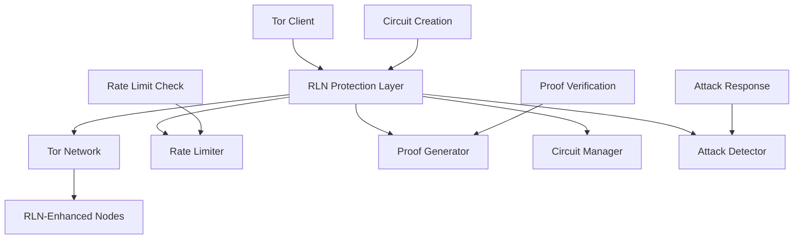

# Improve Tor DoS Protection using RLN

> **📢 ATTRIBUTION: This project idea originated from the Rate Limiting Nullifier (RLN) project for enhanced DoS protection**
> 
> **RLN Documentation: https://rate-limiting-nullifier.github.io/rln-docs/**
> 
> **Focus: Integrating Rate Limiting Nullifier (RLN) technology with Tor to provide robust protection against denial-of-service attacks while maintaining user privacy**

---

## Overview

A project to integrate Rate Limiting Nullifier (RLN) technology with Tor's network infrastructure to provide advanced protection against denial-of-service (DoS) attacks. This initiative addresses the critical vulnerability that Tor faces from DoS attacks, which can compromise network availability, user privacy, and overall network resilience. By combining RLN's zero-knowledge rate limiting with Tor's anonymity network, we can create a robust defense system that protects against attacks while preserving user privacy.

## Problem Statement

Tor's current DoS protection mechanisms are limited and can be circumvented by sophisticated attackers. Traditional rate limiting approaches either compromise user privacy by requiring identification or are easily bypassed through IP rotation and botnet attacks. The network lacks effective mechanisms to distinguish between legitimate users and malicious actors, leading to service degradation, circuit failures, and potential deanonymization attacks. This project aims to solve these issues by implementing RLN-based protection that provides strong DoS resistance without compromising the core privacy guarantees of Tor.

## Proposed Solution

### Core Components

1. **RLN-Enhanced Tor Network**
   - **Rate Limiting Nodes**: Tor nodes with integrated RLN protection
   - **Zero-Knowledge Proofs**: Privacy-preserving rate limit verification
   - **Dynamic Rate Adjustment**: Adaptive rate limiting based on network conditions
   - **Sybil Resistance**: Protection against identity-based attacks

2. **Advanced DoS Protection**
   - **Circuit-Level Protection**: Rate limiting at the Tor circuit level
   - **Node-Level Protection**: Protection for individual Tor nodes
   - **Network-Level Protection**: Coordinated protection across the Tor network
   - **Attack Detection**: Real-time detection and response to DoS attempts

3. **Privacy-Preserving Security**
   - **Anonymous Rate Limiting**: Rate limits without user identification
   - **Circuit Rotation**: Automatic circuit rotation under attack conditions
   - **Fallback Mechanisms**: Graceful degradation during attacks
   - **Privacy Metrics**: Comprehensive privacy and security monitoring

## Technical Architecture

### System Architecture


### RLN Integration Implementation
```rust
// Example Rust implementation for RLN integration with Tor
use rln::{RLN, RateLimit, Proof, Nullifier};
use tor_client::{TorClient, Circuit, CircuitConfig};
use zero_knowledge_proofs::zkp::ZKP;

pub struct RLNProtectedTorClient {
    tor_client: TorClient,
    rln: RLN,
    rate_limits: RateLimitManager,
    attack_detector: AttackDetector,
}

impl RLNProtectedTorClient {
    pub async fn new(config: RLNTorConfig) -> Result<Self, ClientError> {
        let tor_client = TorClient::new(config.tor_config).await?;
        let rln = RLN::new(config.rln_config).await?;
        let rate_limits = RateLimitManager::new(config.rate_limit_config);
        let attack_detector = AttackDetector::new(config.attack_detection_config);
        
        Ok(Self {
            tor_client,
            rln,
            rate_limits,
            attack_detector,
        })
    }
    
    pub async fn create_circuit(&self, config: CircuitConfig) -> Result<Circuit, CircuitError> {
        // Check rate limits before creating circuit
        let rate_check = self.rate_limits.check_circuit_creation().await?;
        
        if !rate_check.allowed {
            return Err(CircuitError::RateLimitExceeded);
        }
        
        // Generate RLN proof for circuit creation
        let proof = self.rln.generate_proof(
            "circuit_creation",
            rate_check.nullifier,
            rate_check.timestamp
        ).await?;
        
        // Create circuit through Tor with RLN protection
        let circuit = self.tor_client.create_circuit(config).await?;
        
        // Register circuit with RLN protection
        self.rln.register_circuit(circuit.id(), proof).await?;
        
        Ok(circuit)
    }
    
    pub async fn send_data(&self, circuit: &Circuit, data: &[u8]) -> Result<(), SendError> {
        // Check rate limits for data transmission
        let rate_check = self.rate_limits.check_data_transmission(data.len()).await?;
        
        if !rate_check.allowed {
            return Err(SendError::RateLimitExceeded);
        }
        
        // Generate proof for data transmission
        let proof = self.rln.generate_proof(
            "data_transmission",
            rate_check.nullifier,
            rate_check.timestamp
        ).await?;
        
        // Check for attack patterns
        let attack_detected = self.attack_detector.analyze_transmission(
            circuit.id(),
            data,
            &proof
        ).await?;
        
        if attack_detected {
            // Implement attack response
            self.handle_attack(circuit, &attack_detected).await?;
            return Err(SendError::AttackDetected);
        }
        
        // Send data through protected circuit
        self.tor_client.send_data(circuit, data).await?;
        
        // Update rate limit counters
        self.rate_limits.update_transmission_count(data.len()).await?;
        
        Ok(())
    }
    
    async fn handle_attack(&self, circuit: &Circuit, attack: &AttackInfo) -> Result<(), AttackError> {
        match attack.attack_type {
            AttackType::DoS => {
                // Rotate circuit to avoid attack
                self.rotate_circuit(circuit).await?;
                
                // Increase rate limiting for this circuit
                self.rate_limits.increase_protection(circuit.id()).await?;
                
                // Report attack to network
                self.report_attack(attack).await?;
            }
            AttackType::Sybil => {
                // Implement Sybil resistance measures
                self.implement_sybil_resistance(circuit).await?;
            }
            AttackType::Correlation => {
                // Implement correlation resistance
                self.implement_correlation_resistance(circuit).await?;
            }
        }
        
        Ok(())
    }
}

// Rate Limit Manager for managing rate limits
pub struct RateLimitManager {
    config: RateLimitConfig,
    counters: HashMap<String, RateLimitCounter>,
    limits: HashMap<String, RateLimit>,
}

impl RateLimitManager {
    pub async fn check_circuit_creation(&self) -> Result<RateLimitCheck, RateLimitError> {
        let user_id = self.get_anonymous_user_id().await?;
        let counter = self.get_counter(&user_id, "circuit_creation").await?;
        
        let limit = self.get_limit("circuit_creation")?;
        let allowed = counter.check_limit(limit).await?;
        
        Ok(RateLimitCheck {
            allowed,
            nullifier: counter.nullifier.clone(),
            timestamp: SystemTime::now(),
            remaining: limit.max_requests - counter.current_count,
        })
    }
    
    pub async fn check_data_transmission(&self, data_size: usize) -> Result<RateLimitCheck, RateLimitError> {
        let user_id = self.get_anonymous_user_id().await?;
        let counter = self.get_counter(&user_id, "data_transmission").await?;
        
        let limit = self.get_limit("data_transmission")?;
        let allowed = counter.check_limit_with_size(limit, data_size).await?;
        
        Ok(RateLimitCheck {
            allowed,
            nullifier: counter.nullifier.clone(),
            timestamp: SystemTime::now(),
            remaining: limit.max_bytes - counter.current_bytes,
        })
    }
    
    async fn get_anonymous_user_id(&self) -> Result<String, RateLimitError> {
        // Generate anonymous user ID without compromising privacy
        let random_bytes = rand::random::<[u8; 32]>();
        let user_id = base64::encode(random_bytes);
        
        Ok(user_id)
    }
}

// Attack Detector for identifying and responding to attacks
pub struct AttackDetector {
    config: AttackDetectionConfig,
    patterns: Vec<AttackPattern>,
    history: HashMap<String, AttackHistory>,
}

impl AttackDetector {
    pub async fn analyze_transmission(
        &self,
        circuit_id: String,
        data: &[u8],
        proof: &Proof
    ) -> Result<Option<AttackInfo>, DetectionError> {
        // Analyze transmission patterns
        let pattern_analysis = self.analyze_patterns(circuit_id, data).await?;
        
        // Check for DoS patterns
        let dos_detected = self.detect_dos_attack(pattern_analysis).await?;
        
        // Check for Sybil patterns
        let sybil_detected = self.detect_sybil_attack(pattern_analysis).await?;
        
        // Check for correlation attacks
        let correlation_detected = self.detect_correlation_attack(pattern_analysis).await?;
        
        // Determine if attack is detected
        if dos_detected || sybil_detected || correlation_detected {
            let attack_type = if dos_detected {
                AttackType::DoS
            } else if sybil_detected {
                AttackType::Sybil
            } else {
                AttackType::Correlation
            };
            
            let attack_info = AttackInfo {
                attack_type,
                circuit_id,
                timestamp: SystemTime::now(),
                severity: self.calculate_severity(pattern_analysis).await?,
                evidence: pattern_analysis,
            };
            
            Ok(Some(attack_info))
        } else {
            Ok(None)
        }
    }
    
    async fn detect_dos_attack(&self, analysis: PatternAnalysis) -> Result<bool, DetectionError> {
        // Check for rapid circuit creation
        let rapid_circuits = analysis.circuit_creation_rate > self.config.max_circuit_rate;
        
        // Check for excessive data transmission
        let excessive_data = analysis.data_transmission_rate > self.config.max_data_rate;
        
        // Check for connection flooding
        let connection_flooding = analysis.connection_attempts > self.config.max_connection_attempts;
        
        Ok(rapid_circuits || excessive_data || connection_flooding)
    }
    
    async fn detect_sybil_attack(&self, analysis: PatternAnalysis) -> Result<bool, DetectionError> {
        // Check for multiple identities from same source
        let multiple_identities = analysis.unique_identities > self.config.max_identities_per_source;
        
        // Check for identity rotation patterns
        let identity_rotation = analysis.identity_rotation_rate > self.config.max_identity_rotation;
        
        Ok(multiple_identities || identity_rotation)
    }
    
    async fn detect_correlation_attack(&self, analysis: PatternAnalysis) -> Result<bool, DetectionError> {
        // Check for timing correlation patterns
        let timing_correlation = analysis.timing_correlation > self.config.max_timing_correlation;
        
        // Check for traffic pattern correlation
        let traffic_correlation = analysis.traffic_correlation > self.config.max_traffic_correlation;
        
        Ok(timing_correlation || traffic_correlation)
    }
}
```

### RLN Configuration and Setup
```typescript
// Example TypeScript configuration for RLN integration
interface RLNTorConfig {
    // Tor configuration
    tor: {
        dataDir: string;
        controlPort: number;
        socksPort: number;
        maxCircuits: number;
        circuitTimeout: number;
    };
    
    // RLN configuration
    rln: {
        merkleTreeDepth: number;
        rateLimitWindow: number; // seconds
        maxRequestsPerWindow: number;
        maxBytesPerWindow: number;
        nullifierSecret: string;
        zkpCircuitPath: string;
    };
    
    // Rate limiting configuration
    rateLimits: {
        circuitCreation: {
            maxPerMinute: number;
            maxPerHour: number;
            maxPerDay: number;
        };
        dataTransmission: {
            maxBytesPerMinute: number;
            maxBytesPerHour: number;
            maxBytesPerDay: number;
        };
        connectionAttempts: {
            maxPerMinute: number;
            maxPerHour: number;
            maxPerDay: number;
        };
    };
    
    // Attack detection configuration
    attackDetection: {
        dosThreshold: number;
        sybilThreshold: number;
        correlationThreshold: number;
        responseDelay: number; // milliseconds
        circuitRotationDelay: number; // milliseconds
    };
}

class RLNTorNetwork {
    private config: RLNTorConfig;
    private nodes: Map<string, RLNProtectedNode>;
    private rateLimitCoordinator: RateLimitCoordinator;
    private attackResponseCoordinator: AttackResponseCoordinator;
    
    constructor(config: RLNTorConfig) {
        this.config = config;
        this.nodes = new Map();
        this.rateLimitCoordinator = new RateLimitCoordinator(config.rateLimits);
        this.attackResponseCoordinator = new AttackResponseCoordinator(config.attackDetection);
    }
    
    async addNode(nodeId: string, node: RLNProtectedNode): Promise<void> {
        // Register node with rate limit coordinator
        await this.rateLimitCoordinator.registerNode(nodeId, node);
        
        // Register node with attack response coordinator
        await this.attackResponseCoordinator.registerNode(nodeId, node);
        
        // Add to network
        this.nodes.set(nodeId, node);
        
        console.log(`Node ${nodeId} added to RLN-protected Tor network`);
    }
    
    async removeNode(nodeId: string): Promise<void> {
        // Unregister from coordinators
        await this.rateLimitCoordinator.unregisterNode(nodeId);
        await this.attackResponseCoordinator.unregisterNode(nodeId);
        
        // Remove from network
        this.nodes.delete(nodeId);
        
        console.log(`Node ${nodeId} removed from RLN-protected Tor network`);
    }
    
    async coordinateRateLimits(): Promise<void> {
        // Coordinate rate limits across all nodes
        await this.rateLimitCoordinator.coordinate();
        
        // Update rate limits based on network conditions
        await this.updateNetworkRateLimits();
    }
    
    async coordinateAttackResponse(): Promise<void> {
        // Coordinate attack responses across all nodes
        await this.attackResponseCoordinator.coordinate();
        
        // Share attack intelligence
        await this.shareAttackIntelligence();
    }
    
    private async updateNetworkRateLimits(): Promise<void> {
        // Get current network load
        const networkLoad = await this.getNetworkLoad();
        
        // Adjust rate limits based on load
        if (networkLoad > this.config.rln.rateLimitWindow * 0.8) {
            // High load - reduce rate limits
            await this.rateLimitCoordinator.reduceRateLimits(0.8);
        } else if (networkLoad < this.config.rln.rateLimitWindow * 0.3) {
            // Low load - increase rate limits
            await this.rateLimitCoordinator.increaseRateLimits(1.2);
        }
    }
    
    private async shareAttackIntelligence(): Promise<void> {
        // Get attack reports from all nodes
        const attackReports = await this.attackResponseCoordinator.getAttackReports();
        
        // Analyze attack patterns
        const attackPatterns = this.analyzeAttackPatterns(attackReports);
        
        // Share patterns with all nodes
        for (const [nodeId, node] of this.nodes) {
            await node.updateAttackPatterns(attackPatterns);
        }
    }
}
```

## Implementation Roadmap

### Phase 1: RLN Integration (4 months)
- Integrate RLN with Tor client
- Implement rate limiting mechanisms
- Create proof generation and verification
- Develop attack detection framework
- Basic protection testing

### Phase 2: Advanced Protection (3 months)
- Implement circuit-level protection
- Add node-level protection
- Create network-level coordination
- Develop attack response mechanisms
- Performance optimization

### Phase 3: Privacy Enhancement (3 months)
- Implement privacy-preserving rate limiting
- Add anonymous attack reporting
- Create privacy metrics
- Develop fallback mechanisms
- Security analysis

### Phase 4: Testing and Deployment (2 months)
- Network testing and validation
- Attack simulation and testing
- Performance and privacy testing
- Documentation and guides
- Community deployment

## Business Model

### Open Source Contribution
- All RLN integration code is open source
- Protection mechanisms are freely available
- Community-driven development
- Focus on network security and privacy

### Value Proposition
1. **For Tor Network**: Enhanced DoS protection and resilience
2. **For Users**: Improved network availability and privacy
3. **For Node Operators**: Better protection against attacks
4. **For Security**: Advanced attack detection and response

## Key Features

### Protection Features
- **DoS Resistance**: Robust protection against denial-of-service attacks
- **Sybil Resistance**: Protection against identity-based attacks
- **Correlation Resistance**: Protection against traffic correlation attacks
- **Rate Limiting**: Privacy-preserving rate limiting mechanisms
- **Attack Detection**: Real-time attack detection and response

### Privacy Features
- **Zero-Knowledge Proofs**: Rate limiting without user identification
- **Anonymous Protection**: Protection mechanisms preserve user privacy
- **Circuit Rotation**: Automatic circuit rotation under attack
- **Privacy Metrics**: Comprehensive privacy and security monitoring
- **Fallback Mechanisms**: Graceful degradation during attacks

### Security Features
- **Network Coordination**: Coordinated protection across Tor network
- **Intelligence Sharing**: Anonymous attack intelligence sharing
- **Adaptive Response**: Dynamic response to different attack types
- **Performance Monitoring**: Real-time performance and security metrics
- **Audit Trail**: Comprehensive security and privacy auditing

## Target Market

### Primary Users
- Tor network operators
- Tor node operators
- Privacy-conscious users
- Security researchers
- Network administrators

### Use Cases
- Enhanced Tor network security
- DoS attack protection
- Network resilience improvement
- Privacy-preserving security
- Attack intelligence sharing

## Success Metrics

- DoS attack success rate reduction
- Network availability improvement
- User experience enhancement
- Attack detection accuracy
- Performance impact measurement
- Community adoption
- Security audit results

## Competitive Advantages

1. **Protection**: Advanced DoS protection mechanisms
2. **Privacy**: Zero-knowledge rate limiting
3. **Coordination**: Network-wide attack response
4. **Intelligence**: Shared attack intelligence
5. **Performance**: Minimal impact on network performance
6. **Innovation**: Cutting-edge security technology

## Partnership Opportunities

### Technology Partners
- Tor Project development team
- RLN development team
- Zero-knowledge proof researchers
- Network security organizations
- Academic institutions

### Community Partners
- Tor node operators
- Privacy advocacy groups
- Security research communities
- Open source foundations
- Network security conferences

## Challenges and Mitigation

### Technical Challenges
- **RLN Integration**: Complex integration with Tor architecture
  - *Mitigation*: Careful architecture design, modular integration, extensive testing
- **Performance Impact**: Rate limiting may affect performance
  - *Mitigation*: Optimized algorithms, background processing, performance monitoring
- **False Positives**: Attack detection may have false positives
  - *Mitigation*: Machine learning algorithms, pattern analysis, community feedback

### Adoption Challenges
- **Network Coordination**: Coordinating protection across distributed network
  - *Mitigation*: Gradual rollout, clear communication, community involvement
- **Performance Expectations**: Users expect fast network performance
  - *Mitigation*: Performance optimization, realistic expectations, protection benefits
- **Complexity**: Advanced protection mechanisms may be complex
  - *Mitigation*: Clear documentation, user education, community support

## Future Vision

### Near-term Enhancements
- Additional attack detection methods
- Machine learning-based protection
- Advanced rate limiting algorithms
- Mobile network protection
- Integration with other networks

### Long-term Goals
- Universal DoS protection
- Integration with major networks
- Advanced security features
- Global deployment and adoption
- Standardization of protection mechanisms

## Community and Governance

- Open source development model
- Community-driven feature development
- Regular security audits and updates
- Transparent development process
- Collaboration with Tor Project and RLN teams

## References

- [Rate Limiting Nullifier (RLN) Documentation](https://rate-limiting-nullifier.github.io/rln-docs/) - Official RLN documentation from PSE (Privacy & Scaling Explorations)
- [Tor Project Onion Service DoS Guidelines](https://community.torproject.org/onion-services/advanced/dos/) - Current Tor DoS mitigation approaches and limitations
- [YouTube Video: Why Tor has a spam/DoS problem](https://www.youtube.com/watch?v=OGhf991iTPc)
- [Tor RLN Flow Diagram](images/tor-rln-flow.png)
- [Tor Project](https://www.torproject.org/)
- [Zero-Knowledge Proofs](https://en.wikipedia.org/wiki/Zero-knowledge_proof)
- [Denial-of-Service Protection](https://en.wikipedia.org/wiki/Denial-of-service_attack)
- [Network Security](https://en.wikipedia.org/wiki/Network_security)

