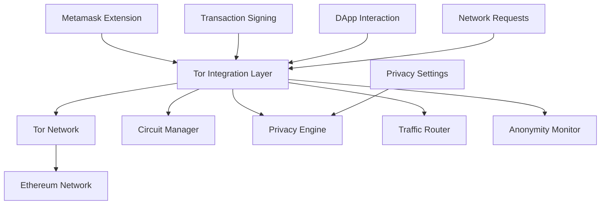

# Integrate Tor into Metamask and Improve its UX

> **📢 ATTRIBUTION: This project idea originated from [@CPerezz19's tweet](https://x.com/CPerezz19/status/1942604947763478695)**
> 
> **Original tweet source: https://x.com/CPerezz19/status/1942604947763478695**
> 
> **Focus: Integrating Tor's privacy network into Metamask wallet to enhance user privacy and improve the overall user experience**

---

## Overview

A project to integrate Tor's anonymity network directly into Metamask, the world's most popular Ethereum wallet, to provide enhanced privacy for cryptocurrency transactions and interactions. This initiative addresses the critical privacy vulnerabilities that users face when using Web3 applications, where their IP addresses, transaction patterns, and wallet activities can be easily traced and correlated with their real-world identities.

## Problem Statement

Metamask users currently face significant privacy risks when interacting with Web3 applications. Every transaction, signature request, and DApp interaction exposes the user's IP address, allowing for deanonymization, transaction correlation, and targeted attacks. Users' wallet activities can be traced back to their real-world identities through network analysis, compromising financial privacy and security. Additionally, the current Metamask UX doesn't provide users with privacy options or education about privacy risks, leaving them vulnerable to surveillance and tracking.

## Proposed Solution

### Core Components

1. **Tor-Integrated Metamask Extension**
   - **Built-in Tor Client**: Native Tor integration within Metamask
   - **Automatic Privacy Mode**: Seamless Tor routing for all transactions
   - **Circuit Management**: Automatic Tor circuit rotation and management
   - **Privacy Settings**: User-configurable privacy levels and preferences

2. **Enhanced User Experience**
   - **Privacy Dashboard**: Visual representation of privacy status
   - **Transaction Anonymity**: Hide transaction origins and patterns
   - **DApp Privacy**: Anonymous interaction with decentralized applications
   - **Privacy Education**: Built-in privacy tutorials and best practices

3. **Advanced Privacy Features**
   - **Multi-Circuit Routing**: Route different transactions through different Tor circuits
   - **Traffic Obfuscation**: Hide Metamask usage patterns
   - **Privacy Metrics**: Real-time privacy and anonymity measurements
   - **Fallback Mechanisms**: Graceful degradation when Tor is unavailable

## Technical Architecture

### System Architecture


### Tor Integration Implementation
```typescript
// Example TypeScript implementation for Tor integration in Metamask
import { TorClient, Circuit, OnionService } from '@tor/metamask-sdk';
import { MetaMaskProvider } from '@metamask/providers';

class TorMetaMaskProvider extends MetaMaskProvider {
    private torClient: TorClient;
    private privacyEngine: PrivacyEngine;
    private circuitManager: CircuitManager;
    private privacySettings: PrivacySettings;
    
    constructor(config: TorMetaMaskConfig) {
        super(config);
        
        this.torClient = new TorClient({
            dataDir: config.torDataDir,
            controlPort: config.torControlPort,
            socksPort: config.torSocksPort,
            maxCircuits: 5,
        });
        
        this.privacyEngine = new PrivacyEngine(this.torClient);
        this.circuitManager = new CircuitManager(this.torClient);
        this.privacySettings = new PrivacySettings();
        
        this.initializeTor();
    }
    
    private async initializeTor(): Promise<void> {
        try {
            await this.torClient.start();
            await this.circuitManager.createInitialCircuits();
            
            console.log('Tor integration initialized successfully');
        } catch (error) {
            console.error('Failed to initialize Tor:', error);
            // Fallback to non-Tor mode
            this.enableFallbackMode();
        }
    }
    
    async request(request: RequestArguments): Promise<unknown> {
        // Check if privacy mode is enabled
        if (this.privacySettings.isPrivacyEnabled()) {
            return this.handlePrivateRequest(request);
        } else {
            return super.request(request);
        }
    }
    
    private async handlePrivateRequest(request: RequestArguments): Promise<unknown> {
        // Get available Tor circuit
        const circuit = await this.circuitManager.getCircuit();
        
        // Route request through Tor
        const privateRequest = await this.privacyEngine.anonymizeRequest(request, circuit);
        
        // Execute request through Tor
        const response = await this.executeThroughTor(privateRequest, circuit);
        
        // Update privacy metrics
        this.privacyEngine.updateMetrics(circuit, request);
        
        return response;
    }
    
    async sendTransaction(transaction: TransactionRequest): Promise<string> {
        if (this.privacySettings.isTransactionPrivacyEnabled()) {
            return this.sendPrivateTransaction(transaction);
        } else {
            return super.sendTransaction(transaction);
        }
    }
    
    private async sendPrivateTransaction(transaction: TransactionRequest): Promise<string> {
        // Get dedicated circuit for transaction
        const circuit = await this.circuitManager.getTransactionCircuit();
        
        // Anonymize transaction
        const privateTransaction = await this.privacyEngine.anonymizeTransaction(transaction, circuit);
        
        // Send through Tor
        const txHash = await this.broadcastThroughTor(privateTransaction, circuit);
        
        // Rotate circuit after transaction
        await this.circuitManager.rotateCircuit(circuit.id);
        
        return txHash;
    }
    
    async signMessage(message: string): Promise<string> {
        if (this.privacySettings.isSignaturePrivacyEnabled()) {
            return this.signPrivateMessage(message);
        } else {
            return super.signMessage(message);
        }
    }
    
    private async signPrivateMessage(message: string): Promise<string> {
        // Get circuit for signature
        const circuit = await this.circuitManager.getCircuit();
        
        // Anonymize message signing request
        const privateMessage = await this.privacyEngine.anonymizeMessage(message, circuit);
        
        // Sign message
        const signature = await super.signMessage(privateMessage);
        
        // Update privacy metrics
        this.privacyEngine.recordSignature(circuit, message);
        
        return signature;
    }
}

// Privacy Engine for handling anonymization
class PrivacyEngine {
    private torClient: TorClient;
    private metrics: PrivacyMetrics;
    
    constructor(torClient: TorClient) {
        this.torClient = torClient;
        this.metrics = new PrivacyMetrics();
    }
    
    async anonymizeRequest(request: RequestArguments, circuit: Circuit): Promise<AnonymizedRequest> {
        // Remove identifying information
        const anonymized = {
            ...request,
            timestamp: Date.now(),
            circuitId: circuit.id,
            privacyLevel: 'high'
        };
        
        // Add circuit-specific metadata
        anonymized.metadata = {
            torVersion: '0.4.7',
            circuitHops: circuit.hops.length,
            anonymitySet: this.calculateAnonymitySet(circuit)
        };
        
        return anonymized;
    }
    
    async anonymizeTransaction(transaction: TransactionRequest, circuit: Circuit): Promise<AnonymizedTransaction> {
        // Create anonymous transaction
        const anonymized = {
            ...transaction,
            nonce: await this.getAnonymousNonce(circuit),
            gasPrice: await this.getAnonymousGasPrice(circuit),
            maxFeePerGas: await this.getAnonymousMaxFee(circuit),
            maxPriorityFeePerGas: await this.getAnonymousPriorityFee(circuit)
        };
        
        // Add privacy metadata
        anonymized.privacy = {
            circuitId: circuit.id,
            anonymityLevel: 'maximum',
            timestamp: Date.now()
        };
        
        return anonymized;
    }
    
    async anonymizeMessage(message: string, circuit: Circuit): Promise<string> {
        // Add circuit identifier to message
        const circuitId = circuit.id;
        const timestamp = Date.now();
        
        // Create anonymous message format
        const anonymousMessage = {
            content: message,
            circuitId,
            timestamp,
            privacy: 'enabled'
        };
        
        return JSON.stringify(anonymousMessage);
    }
    
    private calculateAnonymitySet(circuit: Circuit): number {
        // Calculate anonymity set based on circuit characteristics
        const baseAnonymity = 1000; // Base anonymity set
        const circuitMultiplier = circuit.hops.length * 100;
        const timeMultiplier = Math.floor(Date.now() / (24 * 60 * 60 * 1000)); // Daily rotation
        
        return baseAnonymity * circuitMultiplier * timeMultiplier;
    }
}
```

### Privacy Dashboard UI
```typescript
// Example React component for privacy dashboard
import React, { useState, useEffect } from 'react';
import { PrivacyMetrics, CircuitStatus, AnonymityLevel } from './types';

interface PrivacyDashboardProps {
    privacyEngine: PrivacyEngine;
    circuitManager: CircuitManager;
}

export const PrivacyDashboard: React.FC<PrivacyDashboardProps> = ({
    privacyEngine,
    circuitManager
}) => {
    const [metrics, setMetrics] = useState<PrivacyMetrics | null>(null);
    const [circuitStatus, setCircuitStatus] = useState<CircuitStatus[]>([]);
    const [anonymityLevel, setAnonymityLevel] = useState<AnonymityLevel>('high');
    
    useEffect(() => {
        const updateMetrics = async () => {
            const currentMetrics = await privacyEngine.getMetrics();
            const currentCircuits = await circuitManager.getCircuitStatus();
            
            setMetrics(currentMetrics);
            setCircuitStatus(currentCircuits);
        };
        
        updateMetrics();
        const interval = setInterval(updateMetrics, 5000);
        
        return () => clearInterval(interval);
    }, [privacyEngine, circuitManager]);
    
    return (
        <div className="privacy-dashboard">
            <h2>Privacy Dashboard</h2>
            
            {/* Privacy Status */}
            <div className="privacy-status">
                <h3>Current Privacy Status</h3>
                <div className="status-indicator">
                    <span className={`status-dot ${anonymityLevel}`}></span>
                    <span className="status-text">
                        {anonymityLevel === 'high' ? 'High Privacy' : 'Standard Mode'}
                    </span>
                </div>
            </div>
            
            {/* Circuit Information */}
            <div className="circuit-info">
                <h3>Tor Circuits</h3>
                <div className="circuit-list">
                    {circuitStatus.map((circuit, index) => (
                        <div key={circuit.id} className="circuit-item">
                            <div className="circuit-id">Circuit {index + 1}</div>
                            <div className="circuit-status">
                                <span className={`status ${circuit.status}`}>
                                    {circuit.status}
                                </span>
                            </div>
                            <div className="circuit-hops">{circuit.hops.length} hops</div>
                            <div className="circuit-uptime">
                                {Math.floor(circuit.uptime / 1000)}s
                            </div>
                        </div>
                    ))}
                </div>
            </div>
            
            {/* Privacy Metrics */}
            {metrics && (
                <div className="privacy-metrics">
                    <h3>Privacy Metrics</h3>
                    <div className="metrics-grid">
                        <div className="metric">
                            <div className="metric-label">Anonymity Set</div>
                            <div className="metric-value">{metrics.anonymitySet.toLocaleString()}</div>
                        </div>
                        <div className="metric">
                            <div className="metric-label">Transactions Today</div>
                            <div className="metric-value">{metrics.transactionsToday}</div>
                        </div>
                        <div className="metric">
                            <div className="metric-label">Privacy Score</div>
                            <div className="metric-value">{metrics.privacyScore}/100</div>
                        </div>
                        <div className="metric">
                            <div className="metric-label">Circuit Rotations</div>
                            <div className="metric-value">{metrics.circuitRotations}</div>
                        </div>
                    </div>
                </div>
            )}
            
            {/* Privacy Controls */}
            <div className="privacy-controls">
                <h3>Privacy Controls</h3>
                <div className="control-group">
                    <label>
                        <input
                            type="checkbox"
                            checked={anonymityLevel === 'high'}
                            onChange={(e) => setAnonymityLevel(e.target.checked ? 'high' : 'standard')}
                        />
                        Enable High Privacy Mode
                    </label>
                </div>
                <div className="control-group">
                    <button 
                        className="rotate-circuits-btn"
                        onClick={() => circuitManager.rotateAllCircuits()}
                    >
                        Rotate All Circuits
                    </button>
                </div>
                <div className="control-group">
                    <button 
                        className="privacy-report-btn"
                        onClick={() => privacyEngine.generatePrivacyReport()}
                    >
                        Generate Privacy Report
                    </button>
                </div>
            </div>
        </div>
    );
};
```

### Privacy Settings Configuration
```typescript
// Privacy settings configuration interface
interface PrivacySettings {
    // General privacy settings
    enablePrivacyMode: boolean;
    automaticCircuitRotation: boolean;
    circuitRotationInterval: number; // minutes
    
    // Transaction privacy
    enableTransactionPrivacy: boolean;
    randomizeGasPrices: boolean;
    randomizeNonces: boolean;
    enableTransactionMixing: boolean;
    
    // DApp privacy
    enableDAppPrivacy: boolean;
    hideWalletActivity: boolean;
    randomizeRequestTiming: boolean;
    
    // Network privacy
    enableNetworkPrivacy: boolean;
    hideIPAddress: boolean;
    enableTrafficObfuscation: boolean;
    
    // Advanced settings
    maxCircuits: number;
    circuitTimeout: number; // seconds
    enableFallbackMode: boolean;
    privacyLevel: 'low' | 'medium' | 'high' | 'maximum';
}

class PrivacySettingsManager {
    private settings: PrivacySettings;
    private storage: Storage;
    
    constructor() {
        this.storage = chrome.storage.local;
        this.loadSettings();
    }
    
    async loadSettings(): Promise<void> {
        const stored = await this.storage.get('privacySettings');
        this.settings = {
            ...this.getDefaultSettings(),
            ...stored.privacySettings
        };
    }
    
    async saveSettings(): Promise<void> {
        await this.storage.set({ privacySettings: this.settings });
    }
    
    getSettings(): PrivacySettings {
        return { ...this.settings };
    }
    
    async updateSettings(updates: Partial<PrivacySettings>): Promise<void> {
        this.settings = { ...this.settings, ...updates };
        await this.saveSettings();
    }
    
    private getDefaultSettings(): PrivacySettings {
        return {
            enablePrivacyMode: true,
            automaticCircuitRotation: true,
            circuitRotationInterval: 5,
            enableTransactionPrivacy: true,
            randomizeGasPrices: true,
            randomizeNonces: true,
            enableTransactionMixing: false,
            enableDAppPrivacy: true,
            hideWalletActivity: true,
            randomizeRequestTiming: true,
            enableNetworkPrivacy: true,
            hideIPAddress: true,
            enableTrafficObfuscation: true,
            maxCircuits: 5,
            circuitTimeout: 30,
            enableFallbackMode: true,
            privacyLevel: 'high'
        };
    }
}
```

## Implementation Roadmap

### Phase 1: Core Tor Integration (4 months)
- Integrate Tor client into Metamask extension
- Implement basic circuit management
- Create privacy engine framework
- Develop privacy settings interface
- Basic privacy testing

### Phase 2: Privacy Features (3 months)
- Implement transaction anonymization
- Add message signing privacy
- Create DApp interaction privacy
- Develop privacy metrics
- Add privacy dashboard

### Phase 3: User Experience (3 months)
- Design and implement privacy UI
- Create privacy education content
- Add privacy controls and settings
- Develop privacy reporting
- User testing and feedback

### Phase 4: Testing and Deployment (2 months)
- Security audit and testing
- Performance optimization
- User experience refinement
- Documentation and guides
- Community deployment

## Business Model

### Open Source Contribution
- All Tor integration code is open source
- Privacy features are freely available
- Community-driven development
- Focus on user privacy and security

### Value Proposition
1. **For Users**: Complete transaction and interaction privacy
2. **For Metamask**: Enhanced privacy features and user trust
3. **For Web3**: Privacy-first wallet ecosystem
4. **For Privacy**: Mainstream adoption of privacy tools

## Key Features

### Privacy Features
- **Transaction Anonymity**: Hide transaction origins and patterns
- **Message Privacy**: Anonymous message signing
- **DApp Privacy**: Anonymous Web3 interactions
- **Network Privacy**: Hide IP addresses and locations
- **Circuit Management**: Automatic Tor circuit rotation

### User Experience Features
- **Privacy Dashboard**: Visual privacy status and metrics
- **Privacy Settings**: Configurable privacy levels
- **Privacy Education**: Built-in tutorials and best practices
- **Privacy Reporting**: Detailed privacy analysis
- **Seamless Integration**: No additional setup required

### Security Features
- **Fallback Mechanisms**: Graceful degradation when Tor unavailable
- **Circuit Validation**: Secure circuit creation and management
- **Privacy Auditing**: Comprehensive privacy metrics
- **Attack Resistance**: Protection against deanonymization
- **Secure Storage**: Encrypted privacy settings

## Target Market

### Primary Users
- Metamask wallet users
- Privacy-conscious cryptocurrency users
- DeFi protocol users
- Privacy advocates
- Security researchers

### Use Cases
- Private cryptocurrency transactions
- Anonymous DeFi interactions
- Privacy-enhanced Web3 applications
- Secure wallet operations
- Privacy-focused trading

## Success Metrics

- Number of users enabling privacy features
- Privacy feature adoption rate
- User satisfaction and feedback
- Privacy protection effectiveness
- Community contributions
- Security audit results
- Performance impact

## Competitive Advantages

1. **Privacy**: Complete transaction and interaction anonymity
2. **Integration**: Native Metamask integration
3. **User Experience**: Seamless privacy features
4. **Education**: Built-in privacy tutorials
5. **Community**: Open source and community-driven
6. **Innovation**: Cutting-edge privacy technology

## Partnership Opportunities

### Technology Partners
- Tor Project development team
- Metamask development team
- Privacy technology organizations
- Web3 protocol developers
- Security research groups

### Community Partners
- Privacy rights organizations
- Cryptocurrency privacy advocates
- DeFi communities
- Open source foundations
- Academic institutions

## Challenges and Mitigation

### Technical Challenges
- **Extension Integration**: Integrating Tor into browser extension
  - *Mitigation*: Careful architecture design, performance optimization, extensive testing
- **Performance Impact**: Tor routing adds latency
  - *Mitigation*: Circuit optimization, background processing, user education
- **Browser Compatibility**: Different browser requirements
  - *Mitigation*: Cross-browser testing, fallback mechanisms, gradual rollout

### Adoption Challenges
- **User Education**: Complex privacy concepts for non-technical users
  - *Mitigation*: Clear tutorials, visual interfaces, community support
- **Performance Expectations**: Users expect fast transactions
  - *Mitigation*: Performance optimization, realistic expectations, privacy benefits
- **Trust Requirements**: Users must trust privacy features
  - *Mitigation*: Open source code, security audits, community review

## Future Vision

### Near-term Enhancements
- Additional privacy features
- Mobile wallet integration
- Advanced anonymity techniques
- Privacy analytics
- Integration with other wallets

### Long-term Goals
- Universal wallet privacy
- Integration with major platforms
- Advanced privacy features
- Global adoption and deployment
- Standardization of privacy features

## Community and Governance

- Open source development model
- Community-driven feature development
- Regular security audits and updates
- Transparent development process
- Collaboration with Tor Project team

## References

- [@CPerezz19's Tweet](https://x.com/CPerezz19/status/1942604947763478695)
- [Tor Project](https://www.torproject.org/)
- [Metamask](https://metamask.io/)
- [Ethereum Privacy](https://ethereum.org/en/privacy/)
- [Web3 Privacy](https://web3privacy.org/)

